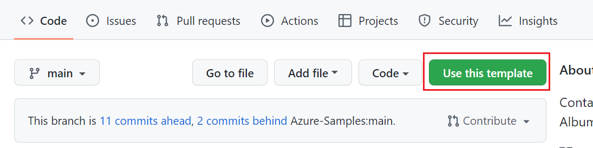
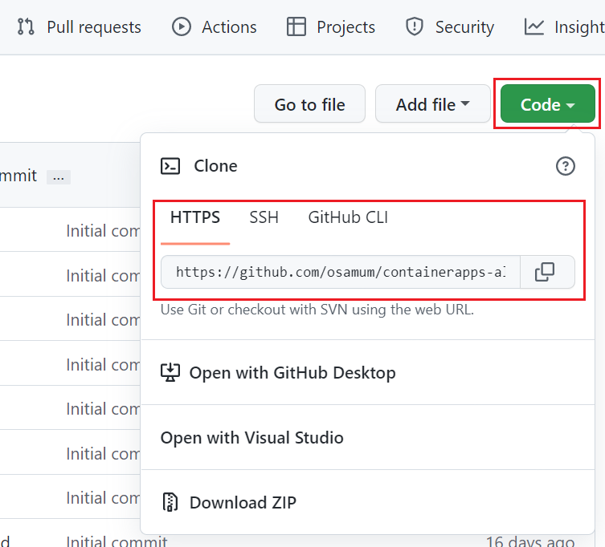

# 事前準備
演習に入る前に準備しておく開発環境の構築や、演習用のプロジェクトの入手について紹介します。
<br><br>

## 1. アカウント
この演習では以下のアカウントが必要です。

お持ちでない場合は以下のリンク先で作成するか、提供されたチケット類がある場合は、提供元からの情報に従いアカウントを作成してください。

   - [**Microsoft Azure**](https://docs.microsoft.com/ja-jp/dotnet/azure/create-azure-account)

   - [**GitHub**](https://github.com/join)

<br><br>


## 2. ローカル開発環境
この演習で使用する開発環境に必要となるツールとランタイム類は以下のとおりです。

リンク先のドキュメントに従いインストールを行い、正常に動作するようあらかじめセットアップしてください。

   - [**Node.js**](https://nodejs.org/ja/download/)
   - [**Git**](https://git-scm.com/book/ja/v2/%E4%BD%BF%E3%81%84%E5%A7%8B%E3%82%81%E3%82%8B-Git%E3%81%AE%E3%82%A4%E3%83%B3%E3%82%B9%E3%83%88%E3%83%BC%E3%83%AB)
   - [**Azure CLI**](https://docs.microsoft.com/ja-jp/cli/azure/install-azure-cli)
   - [**Docker デスクトップ**](https://docs.docker.com/get-docker/) (※) 演習でローカルでのコンテナ アプリの実行を確認する手順を選択しない場合は必要ありません
   - [**Visual Studio Code**](https://code.visualstudio.com/Download)

      Visual Studio Code 拡張

      - [**Azure Resources**](https://marketplace.visualstudio.com/items?itemName=ms-azuretools.vscode-azureresourcegroups)
      - [**Azure Container Apps**](https://marketplace.visualstudio.com/items?itemName=ms-azuretools.vscode-azurecontainerapps)
      - [**Visual Studio Docker 拡張**](https://code.visualstudio.com/docs/containers/overview)

<br><br>

## 3. 演習で使用するプロジェクトの入手
このハンズオンでは、ミュージック ストアを模したサービスを使用します。同サービスはバックエンド サービスとして API を提供する
[**containerapps-albumapi-javascript**]( https://github.com/horihiro/containerapps-albumapi-javascript) と フロントエンド サービスとして Web UI を提供する　[**containerapps-albumui**](https://github.com/horihiro/containerapps-album) の 2 つのシンプルな Node.js プロジェクトで構成されています。

この 2 つのプロジェクトは GitHub に Template リポジトリとして公開されているので、リポジトリのページにある \[**Use this template**\] ボタンを使用してコピーを行います。

具体的な手順は以下のとおりです。

### リポジトリのコピー

- **API アプリ**
    1. 以下の URL にアクセスし、画面内の緑色のボタン `[Use this template]` をクリックします
    https://github.com/horihiro/containerapps-albumapi-javascript

   

   <br>
    
    2. `Create a new project from containerapps-albumapi-javascript` 画面の各項目を以下のように設定します
      
         |  項目  |  値  |
         | ---- | ---- |   
         | Owner * | 自身のアカウント |
         | Repository name * | containerapps-albumapi-javascript |
         | Description (Optional) | 任意の説明 |
         | Public or Private|Private にチェック|
         | Include all branches | チェックしない|
      
      <br>

    3. 同ページの `[Create repository from template]` ボタンをクリックしてご自身の GitHub アカウントに `containerapps-albumui` リポジトリが作成されたことを確認します
 
-  **UI アプリ**
   - 同様の作業を以下のリポジトリに対しても行います
   https://github.com/horihiro/containerapps-albumui

<br><br>

## 4. ローカル環境へのリポジトリのクローン

開発環境で作業を行うために、ご自身の GitHub アカウントに作成した演習用アプリケーション containerapps-albumapi-javascript をローカルにクローンします。

手順は以下のとおりです。

1. Web ブラウザーでご自身の GitHub アカウントに作成したcontainerapps-albumapi-javascript のリポジトリにアクセスします

2. 緑色の \[Code\] ボタンをクリックします。\[HTTPS\] タブが既定アクティブになっているので、表示されている URL をコピーボタンをクリックしてクリップボードにコピーします

   

3. ローカルの任意のフォルダ(ディレクトリ) にターミナル(コマンド プロンプト)からアクセスし、以下のコマンドを実行します

   ```git clone %前の手順でコピーしたリポジトリの URL% ```

4. コマンドの実行が終了したら ls コマンドで containerapps-albumapi-javascript フォルダが作成されていることを確認し、cd コマンドで作業ディレクトリを containerapps-albumapi-javascript に切り替えます。cd コマンドの具体的な書式は以下です

   ```cd containerapps-albumapi-javascript```

5. npm install コマンドを実行してプロジェクトと依存関係のあるモジュールをインストールします。コマンドの具体的な書式は以下です。

   ```npm install``` 

   プロジェクト containerapps-albumui に対しても同様の処理を行います。

