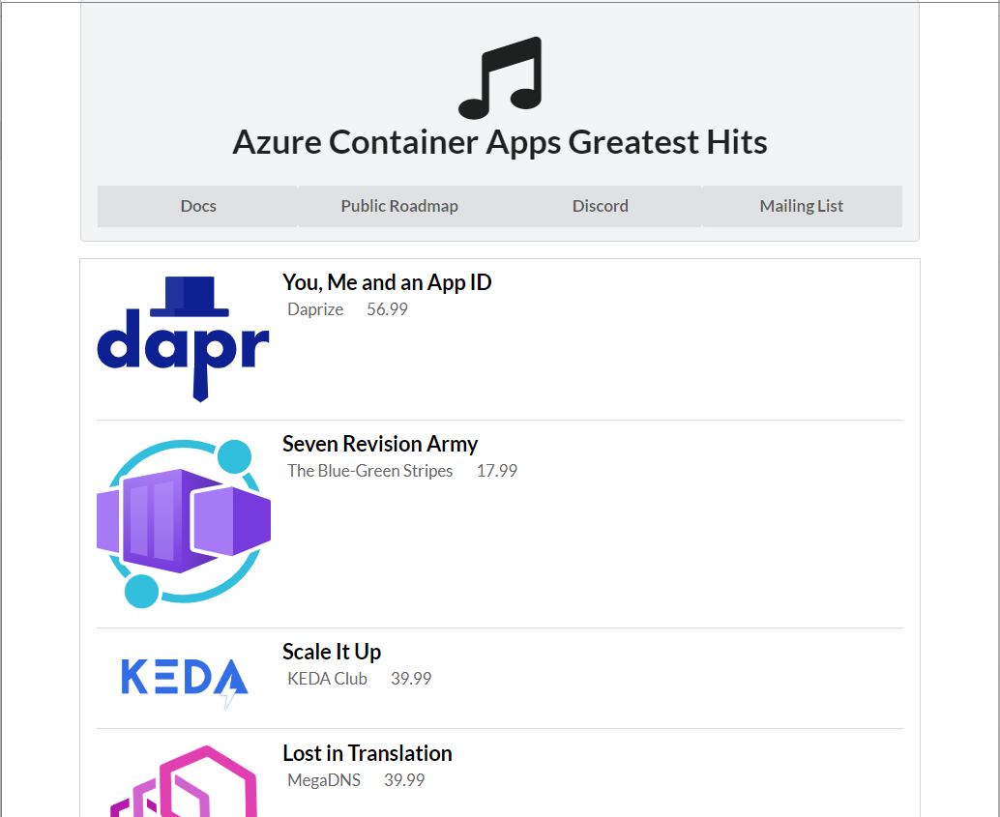

# 演習1) タスク１ - ローカル環境でのプロジェクトの実行

事前準備でローカル環境にクローンした 2 つのプロジェクト **containerapps-albumapi-javascript** と　**containerapps-albumui** がそれぞれシンプルな Node.js アプリケーションとして正しく起動し、連携して正しく動作するかを確認します。

手順は以下の通りです。

### 手順

1. プロジェクト **containerapps-albumapi-javascript**、**containerapps-albumui** について、それぞれのディレクトリを個別のターミナル画面で開きます

2. **containerapps-albumapi-javascript** のターミナル画面で以下のコマンドを実行します

    ```npm start```

3. Web ブラウザーから以下の URL にアクセスし、

	```http://localhost:3500```

	以下のメッセージが返ることを確認します

	```{"message":"Call the /albums route to retrieve a list of albums"}```

4. **containerapps-albumui** のターミナル画面で、プロジェクトを実行する前に Web API の URL を格納する環境変数 **API_BASE_URL** に現在ローカル環境でホストされている **containerapps-albumapi-javascript のエンドポイント**を設定します。コマンドは以下のとおりです。

	**Power Shell を使用している場合**

	設定

	```$env:API_BASE_URL = "http://localhost:3500"```

	設定された内容の表示

	```echo $env:API_BASE_URL```

    <br>

	**Bash を使用している場合**

	設定

	```export API_BASE_URL=http://localhost:3500```

	設定された内容の表示

	```echo $API_BASE_URL```

5. プロジェクトを実行します。**containerapps-albumui** のターミナル画面で以下のコマンドを実行します。

	```npm start```

6. Web ブラウザーから以下の URL にアクセスし、エラーのないアプリケーションの画面が表示されればプロジェクトの準備は完了です。

	```http://localhost:3000```

    

各ターミナル画面でキーボートの \[Ctrl\] + \[C\] をサービスを終了します。

<br><br>

次のタスク : [**Dockerfile の追加**](P1-02.md)へ


　