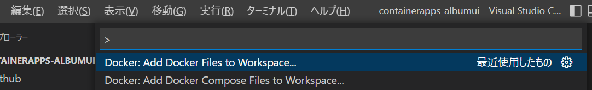
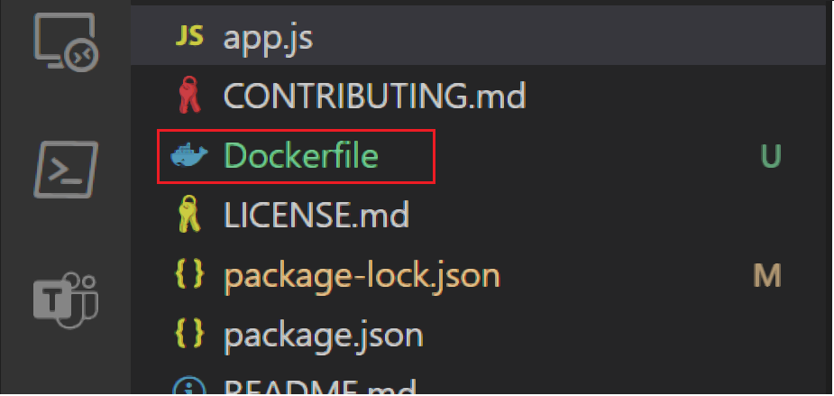
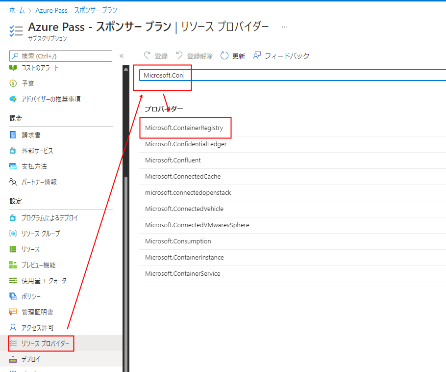

# 演習1) タスク2 - Dockerfile の追加
正常動作が確認できた各プロジェクトに Visual Studio Code の Docker 拡張を使用して、コンテナーの構成情報を含む Dockerfile を追加します。

この手順では Visual Studio Code の [Docker 拡張](https://code.visualstudio.com/docs/containers/overview)を使用しますので、インストールされていない場合はインストールを行ってください。

以下の手順をプロジェクト **containerapps-albumapi-javascript、containerapps-albumui それぞれに**行います。

### 手順

1. Visual Studio Code でプロジェクトをオープンします

2. キーボードの \[F1\] キーを押下して、Visual Studio Code のコマンドバーを表示します

3. コマンドバーから "**Docker: Add Docker Files to Workspace...**" を選択します

    

4. Select Application Platform でドロップダウン リストボックスから "**Node.js**" を選択します

5. Choose a pakage.json file でドロップダウン リストボックスから "**package.json**" を選択します

6. What port(s) does your listen on? (略) で**ポート番号**を指定します  
    以下のように、作業しているプロジェクトにより指定する値が異なりますので注意してください

	containerapps-albumui : **3000** を指定

	containerapps-albumapi-javascript : **3500** を指定

7. Include optional Docker Compose files? で "**No**" を選択します

ここまでの手順で Dockerfile が生成されます。

プロジェクト内に **Dockerfile** という名前のファイルが追加されていることを確認してください。

  
## タスク3 - Docker イメージの作成と  Azure Container Registry への Push

前の手順で生成した Dockerfile から Docker イメージを作成します。
この方法は Azure Container Registry に直接 Docker イメージを作成する演習と、ローカル環境で Docker イメージを作成する演習を**どちらか選択する**ことができます。

前者は Docker イメージの作成からデプロイまで Azure 上で完結するので少ない手順で演習を完了できます。

後者はローカルに Docker デスクトップがインストールされている必要がありますが、演習の手順にローカル環境でのコンテナ化したアプリケーションの実行などを含み、より一般的な作業内容を習得できます。
この 2 つの演習の内容は以下のとおりです。

 **a. [Azure Container Registry に直接 Docker イメージを作成する演習](P1-03-a.md)**

- Azure Container Registry の作成と Docker イメージ 生成

**b. [ローカル環境で Docker イメージを生成する演習](P1-03-b.md)**

- ローカル環境で Docker イメージを生成
- コンテナ化したアプリケーションのローカル環境での実行
- Azure Container Registry の作成と Docker イメージの Push

上記 **a, b どちらか任意の演習を選択し**、実施してください。

### タスク 3 の準備

タスク 3 では、**a,b** の手順とも Azure Container Repository を操作しますが、サブスクリプションによってはリソース プロバイダー Microsoft.ContainerRegistry が登録されておらず、Visual Studio Code 拡張からの操作が失敗する場合があります。

以下の方法で登録されていることを確認するか、登録を行ってください。

手順は以下のとおりです。

1. Azure ポータルにログインします

2. [サブスクリプション メニューかアイコン](https://portal.azure.com/#view/Microsoft_Azure_Billing/SubscriptionsBlade) をクリックすると使用可能なサブスクリプションの一覧を表示されるので、目的のサブスクリプションをクリックします

3. 選択したサブスクリプションの画面に遷移するので、画面左のメニューより\[**リソース プロバイダー**\]メニューをクリックし、遷移した画面の検索ボックスで **Microsoft.ContainerRegistry** を検索します

    

4. \[状態\] フィールドが、**Registered** になっているかを確認し、なっていない場合は検索ボックスの上にある \[登録\] メニューで登録を行ってください。

以上でサブスクリプションへの Microsoft.ContainerRegistry リソース プロバイダーの確認と登録は完了です。

  

次のタスク :

**a. [Azure Container Registry に直接 Docker イメージを作成](P1-03-a.md)**

もしくは

**b. [ローカル環境で Docker イメージを生成](P1-03-b.md)**

  

前のタスク: [**ローカル環境でのプロジェクトの実行**](P1-01.md)
