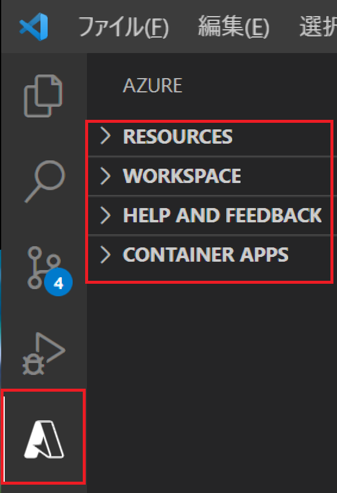
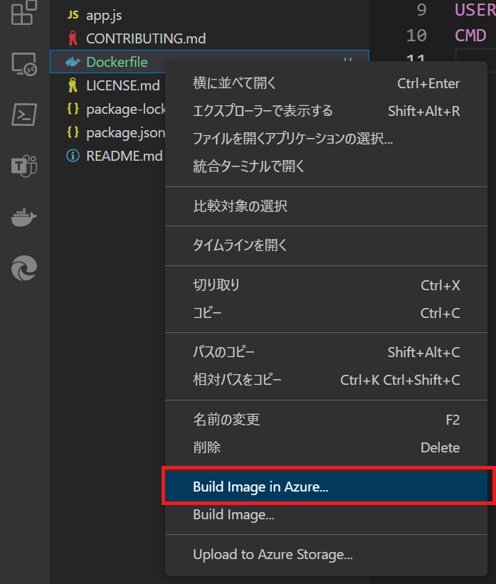

# 演習1) タスク3 - Docker イメージの作成と  Azure Container Registry への Push

## Azure Container Registry に直接 Docker イメージを作成する方法

この演習では Visual Studio Code の Azure 関連の拡張を使用して、Azure 上に Azure Container Registry を新規に作成し、レジストリに直接 Docker イメージを作成します。

この方法ではローカル環境に Docker 環境を用意する必要はなく、また、Docker イメージを手動でプッシュする必要もありません。

手順は以下の通りです。

### 手順

1.  Visual Studio Code でプロジェクト **containerapps-albumapi-javascript** をオープンします

2. キーボードの <kbd>Shift</kbd> + <kbd>Alt</kbd> + <kbd>A</kbd> を押下して Azure 拡張をアクティブにし、\[RESOURCES\] や \[WORKSPACE\] に Azure のリソースがリストされていることを確認します。リストされていない場合は Azure 拡張から Azure にログインします

    

3. キーボードの <kbd>Ctrl</kbd> + <kbd>Shift</kbd> + <kbd>E</kbd> を押下します。表示されたツリービューより Dockerfile を選択して右クリックし、表示されたコンテキストメニューより \[**Build Image in Azure...**\] をクリックします

    

    なお、このメニューは Azure 拡張から Azure へのログインが完了していないとコンテキスト メニューに表示されませんので注意が必要です

4.  コマンドバーに既定の Tag イメージ 名が入力された状態で "Tag image as... (Press 'Enter' to confirm or 'Escape' to cancel)" と表示されるので、そのまま<kbd>Enter</kbd> キーを押下します

5. コマンドバーに "Select subscription" と表示され、所有するサブスクリプションが列挙されるので、使用する Azure サブスクリプションを選択します

6. コマンドバーに "Select registry" と表示され、サブスクリプション中の既存のコンテナレジストリの一覧と "+ Create new registry..." が表示されるので "**+ Create new registry...**" を選択します

7. コマンドバーに "Provide a registry name" と表示されるので名前を指定しますが、**この名前はユニークである必要があるため**名前の前部分を "Handson01Repo" とし、**後ろにユニークな数字などを付加して**キーボードの <kbd>Enter</kbd> キーを押下します

8. コマンドバーに "Select a SKU" と表示されるので "**Basic**" を選択します

9. コマンドバーに "Select a resource group or new resources." と表示され、リソースグループの一覧と "+ Create new resource group..." が表示されるので、"**+ Create new resource group...**" を選択します

10. コマンドバーに "Enter the name of new resource group." と表示されるので、"**Handson01**" と入力し、キーボードの <kbd>Enter</kbd> キーを押下します

11. コマンドバーに "Select a location for new resources" と表示され、リージョンの一覧が表示されるので "**Japan East**" を選択します

12. コマンドバーに "Select image base OS" と表示され、OS の一覧が表示されるので "**Linux**" を選択します

    コマンドが実行され、ここまでの手順中で作成した Azure Container registry に Docker イメージが作成されます。

    > 【メモ】
    > この手順の実行時、タイミングによっては以下のようなメッセージが返り Docker イメージの Push が失敗する場合があります。

    > ```Error: failed to download context. Please check if the URL is incorrect. If it has credentials, please check if they are expired```

    > その場合はステップ 3 からの操作を再度実行してください。 
    
    ステップ 6 のところからここまでの手順をプロジェクト **containerapps-albumui** に対しても行います。

13. 各 Docker イメージの Push が完了したら [Azure ポータル](https://portal.azure.com)にログインし、作成した Azure コンテナー レジストリ **Handson01Repo～** の構成画面を開きます

14. 画面左のメニューより \[リポジドリ\] を選択し、表示されたリポジトリの一覧に **containerapps-albumapi-javascript** と **containerapps-albumui** があることを確認します

15. 画面左のメニューより \[アクセス キー\] をクリックし、遷移した画面内の \[管理者ユーザー\] のトグルボタンを "**有効**"にします

    

    この設定は Azure Container Apps に Docker イメージをデプロイするのに必要です。

ここまでの手順で Azure コンテナ レジストリの作成と Docker イメージの Push は完了です。

次の演習では Azure Container Apps のリソースを作成し、アプリケーションのコンテナーをデプロイします。

<br><br>

次のタスク : [**Azure Container Apps の作成とコンテナーアプリのデプロイ**](P1-04.md)

<br><br>
前のタスク : [**Dockerfile の追加**](P1-02.md)

READMEへ: [**README**](../README.md#%E6%93%8D%E4%BD%9C%E6%89%8B%E9%A0%86)