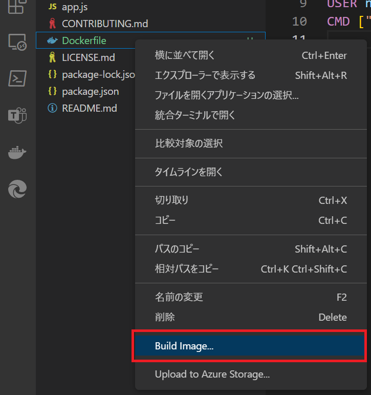
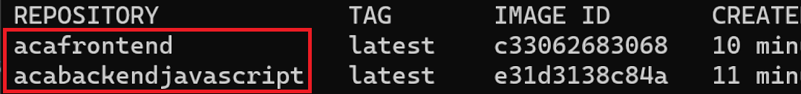
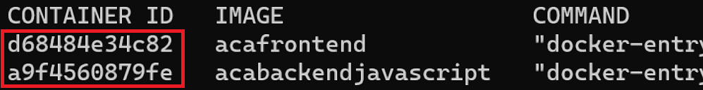
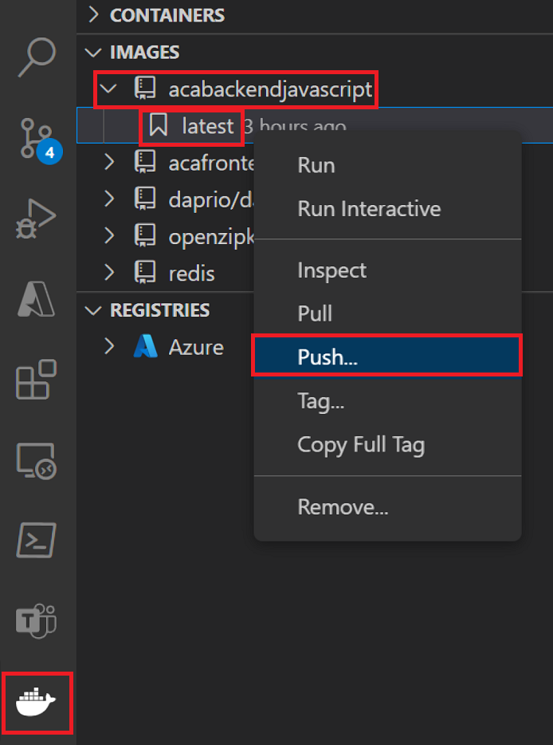
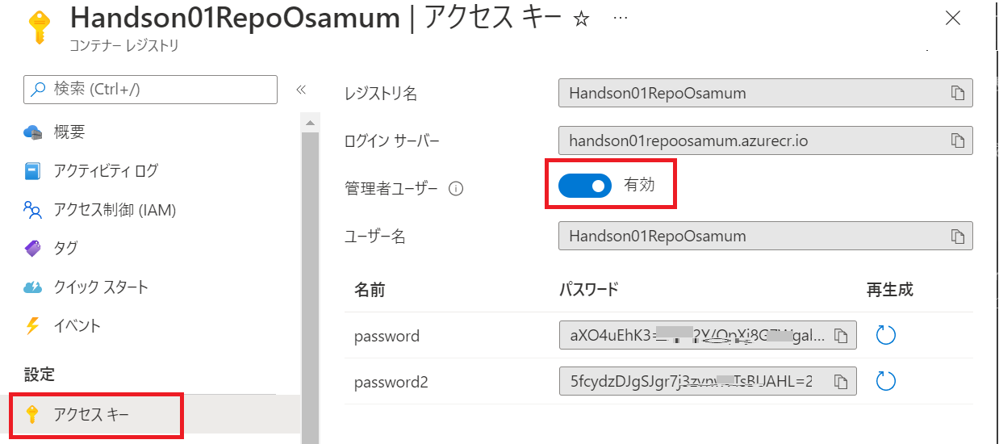

# 演習 1) タスク 3 - Docker イメージの作成と  Azure Container Registry への Push

この演習ではローカル環境に Docker イメージを生成し、ローカル環境にてコンテナー化されたアプリケーションの動作を確認します。

その後、Visual Studio Code の拡張を使用して新規の Azure Container Registry 作成すると同時に Docker イメージを Push します。


<br><br>

## タスク 3-1 :ローカル環境で Docker イメージを生成

Visual Studio Code の Docker 拡張を使用してローカル環境に Docker イメージを生成します。
なお、この演習では [Docker デスクトップ](https://docs.docker.jp/desktop/toc.html)が動作している必要がありますので、動作していない場合は起動しておいてください。

手順は以下のとおりです。

### 手順

1. Visual Studio Code でアプリケーションのプロジェクトをオープンします

2. 画面左側のファイルツリーより Dockerfile を選択して右クリックし、表示されたコンテキストメニューより \[Build Image...\] をクリックし、コマンドの実行が終了するのを待ちます

    

    この作業をプロジェクト **containerapps-albumui**、**containerapps-albumapi-javascript** の両方で行います


3. ターミナル画面で以下のコマンド実行し、

    ```docker images -a```

    REPOSITORY フィールドに acafrontend、aca-backend-javascript がリストされるのを確認します。

    


ここまでの手順で Docker イメージが生成されました。

次のタスクでは生成された Docker イメージからコンテナーを起動し、アプリケーションが正しく動作するかどうかを確認します。

<br><br>

## タスク 3-2 :コンテナー化されたアプリケーションの動作確認
この演習では、前の演習で生成された Docker イメージがコンテナーを起動し、2 つのアプリケーション **containerapps-albumui**、**containerapps-albumapi-javascript** が正しく動作し、連携して動作することを確認します。

具体的な手順は以下のとおりです。

### 手順

1. 最初に **containerapps-albumapi-javascript** のコンテナーを起動します。

    ターミナル画面で以下のコマンドを実行し、サービス側のインスタンスを起動します

	```docker run --publish 3500:3500 acabackendjavascript```

2. Web ブラウザーから以下の URL にアクセスし、

	```http://localhost:3500```

	以下のメッセージが返ることを確認します

	```{"message":"Call the /albums route to retrieve a list of albums"}```

3.  別途ターミナル画面を起動し、以下のコマンドを実行し、ローカルマシンの IPv4 アドレスをメモします

    ```ipconfig``` 

4. UI 側サービスのインスタンスを起動します。 以下のコマンドの %localIPv4address% の部分を前の手順で取得した IPv4 アドレスに置き換え、ターミナル画面で実行します

    ```docker run --publish 3000:3000 -e "API_BASE_URL=http://%localIPv4address%:3500" acafrontend```

    【メモ】
    
    docker run コマンドにて、環境変数を設定するスイッチ -e の指定は、docker イメージ名より前で指定しないとエラーが発生するので注意が必要です。

5. Web ブラウザーから以下の URL にアクセスし、

    ```http://localhost:3000```

	エラーの無いアプリケーションの画面が表示されることを確認します。

    

6. アプリケーションがコンテナーとして定常に動作することが確認できたらアプリケーションのコンテナーを停止します

    ターミナル画面で以下のコマンドを実行して、実行中のコンテナーの一覧を表示し、

    ```docker ps```

    アプリケーション containerapps-albumapi-javascript と   containerapps-albumui の　**CONTAINER ID** を確認してメモします

    

    以下のコマンドの引数にメモしておいた **CONTAINER ID** を使用してcontainerapps-albumapi-javascript と containerapps-albumui のコンテナーを停止します

    ```docker stop %メモしておいた CONTAINER ID%```

    再度 docker ps コマンドを実行して containerapps-albumapi-javascript と containerapps-albumui のコンテナーが一覧に表示されないことを確認します

ここまでの手順で、ローカル環境でコンテナー化されたアプリケーションが正しく動作することが確認できました。

次のタスクでは Docker イメージを新規の Azure Container Registry に Push します。 
<br><br>

## タスク 3-3 : Docker イメージの新規 Azure Container Registry への Push

Visua Studio Code の Docker 拡張を使用してAzure 上に新規の Azure Container Registry を作成し、ローカル環境の containerapps-albumapi-javascript と containerapps-albumui の Docker イメージを Push します。

具体的な手順は以下のとおりです。

### 手順

1. プロジェクト **containerapps-albumapi-javascript** を Visual Studio Code でオープンします

2. 画面左のメニューで Docker アイコンをクリックし、\[IMAGES\] セクションを展開します

     ローカル環境の Docker イメージが列挙されるので、aca-backend-javascript をクリックして展開し、latest を選択して右クリックし、表示されたコンテキストメニューより \[Push...\] をクリックします

    


3. コマンドバーに "Select subscription" と表示され、所有するサブスクリプションが列挙されるので、使用する Azure サブスクリプションを選択します

4. コマンドバーに "Select registry" と表示され、サブスクリプション中のコンテナレジストリの一覧と "+ Create new registry..." が表示されるので "**+ Create new registry...**" を選択します

5. コマンドバーに "Provide a registry name" と表示されるので名前を指定しますが、**この名前はユニークである必要があるため**名前の前部分を "Handson01Repo" とし、**後ろにユニークな数字などを付加して**キーボードの \[Enter\] キーを押下します

6. コマンドバーに "Select a SKU" と表示されるので "**Basic**" を選択します

7. コマンドバーに "Select a resource group or new resources." と表示され、リソースグループの一覧と "+ Create new resource group..." が表示されるので、"**+ Create new resource group...**" を選択します

8. コマンドバーに "Enter the name of new resource group." と表示されるので、"**Handson01**" と入力し、キーボードの \[Enter\] キーを押下します

9. コマンドバーに "Select a location for new resources" と表示され、リージョンの一覧が表示されるので "**Japan East**" を選択します

10. コマンドバーに "Tag image as..." と表示されるので既定のままキーボードの \[Enter\] キーを押下します

	作成した Azure コンテナーレジストリへの Docker イメージの Push が開始されます

11. コマンドの完了を待ち、画面左の\[IMAGES\] セクションで **acafrontend** を展開し、**latest** を選択して右クリックし、表示されたコンテキストメニューより \[Push...\] をクリックします

12. コマンドバーに "Select registry" と表示され、サブスクリプション中のコンテナレジストリの一覧が表示されるので、前の手順で作成した **Handson01Repo～** を選択します

13. コマンドバーに "Tag image as..." と表示されるので既定のままキーボードの \[Enter\] キーを押下します

	作成した Azure コンテナーレジストリへの Docker イメージの Push が開始されます

14. コマンドが終了したら Azure ポータルにログインし、作成した Azure Container Registry Handson01Repo～ の構成画面を開きます

15. 画面左のメニューより \[リポジドリ\] を選択し、表示されたリポジトリの一覧に **acabackendjavascript** と **acafrontend** があることを確認します

16. 画面左のメニューより \[アクセス キー\] をクリックし、遷移した画面内の \[管理者ユーザー\] のトグルボタンを "**有効**"にします

    

    この設定は Azure Container Apps にデプロイするのに必要です。

ここまでの手順で Azure コンテナ レジストリの作成と Docker イメージの Push は完了です。

次の演習では Azure Container Apps のリソースを作成し、アプリケーションのコンテナーをデプロイします。

<br><br>
次のタスク : [**Azure Container Apps の作成とコンテナーアプリのデプロイ**](P1-04.md)

<br><br>
前のタスク : [**Dockerfile の追加**](P1-02.md)