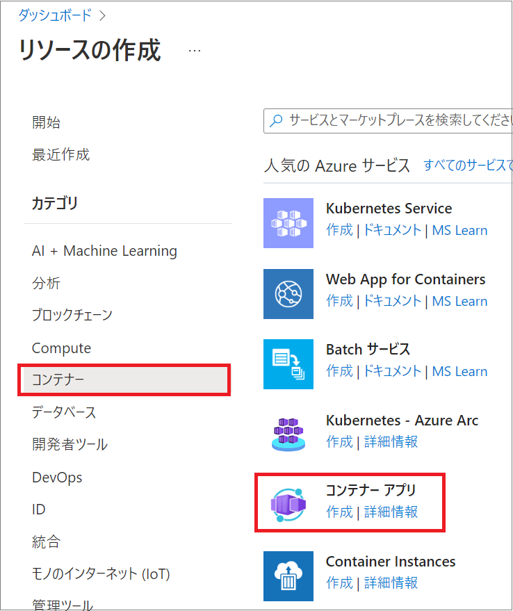
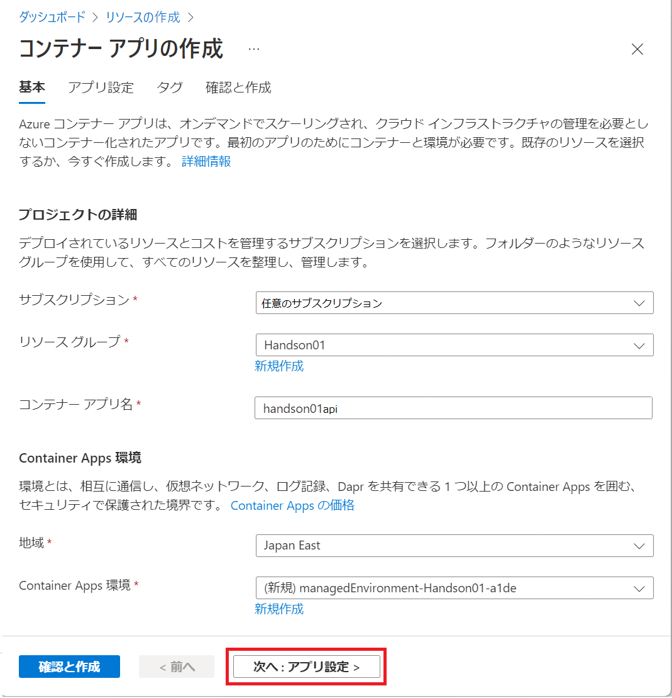
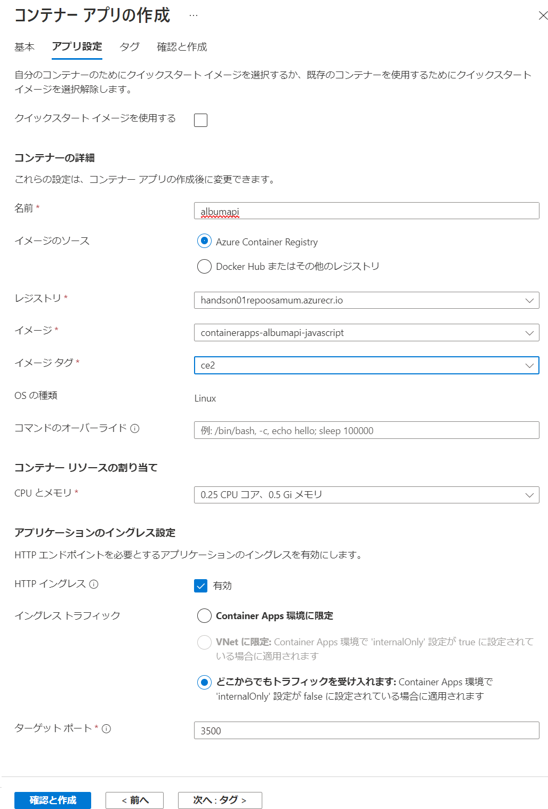
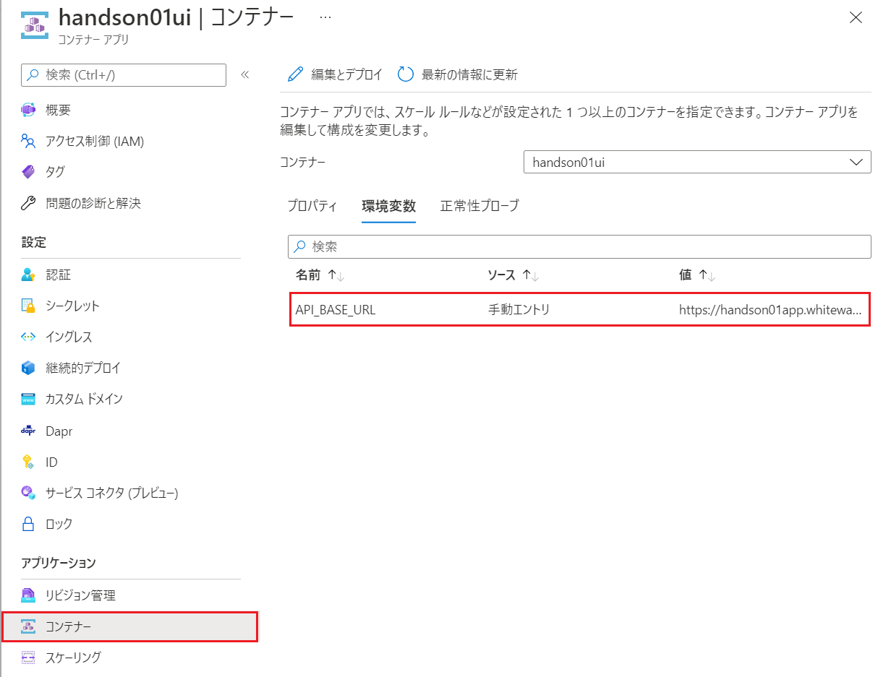
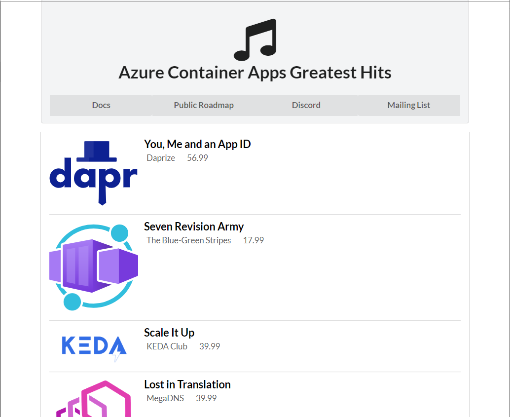

# 演習 1) タスク 4 - Azure Container Apps の作成とコンテナーアプリのデプロイ

## タスク 4-1 : Azure Container Apps のデプロイ

演習 3 で、Azure コンテナー レジストリに Push した Docker イメージをホストするための Azure Container Apps のリソースを作成します。

具体的な手順は以下のとおりです。

### 手順

1. Azure ポータルにログインし、画面左上端のハンバーガーメニューをクリックし、[リソースの作成](https://portal.azure.com/#create/hub) メニューを選択します

2. 遷移した \[リソースの作成\] 画面の左側のメニューで、\[コンテナー\] をクリックすると、コンテナー関連の Azure のサービスの一覧が表示されるので \[コンテナー アプリ\] をクリックします

    

3. コンテナー アプリの作成 画面に遷移するので、各項目を以下のように設定して \[**次へ : アプリ設定 \>**\] ボタンをクリックします

    **プロジェクトの詳細**
    |  項目  |  値  |
    | ---- | ---- |   
    | サブスクリプション* | (この演習に使用する任意のサブスクリプション) |
    | リソース グループ* | Handson01 |
    | コンテナー アプリ名 | handson01api |


    **Container Apps 環境**
    |  項目  |  値  |
    | ---- | ---- |   
    | 地域* | Japan East |
    | Container Apps 環境* | 既定のまま |

    

4. \[アプリ設定\] のタブがアクティブになるので、同画面の **\[クイックスタート イメージを使用する\] チェックボックスのチェックを外す**と、コンテナーの詳細内の項目が変わるので、各項目を以下のように設定します。

    **コンテナーの詳細**
    |  項目  |  値  |
    | ---- | ---- |   
    | 名前 | **albumapi** |
    | イメージのリソース | **Azure Container Registry** にチェック |
    | レジストリ* | ドロップダウンリストから **Handson01Repo%任意の情報を付加したもの%** を選択 |
    | イメージ* | ドロップダウンリストから **containerapps-albumapi-javascript** (もしくは**acabackendjavascript**)を選択 |
    | イメージタグ* | 任意のもの | 

    **コンテナー リソースの割り当て**
    
    このセクションの設定は既定のままです。

    **アプリケーションのイングレス設定**
    項目 \[**HTTP イングレス**\] の設定に **無効** と書かれた空のチェックボックスが表示されていますが、クリックすると \[**有効**\] に表示が変わり、追加の設定項目が表示されますので以下のように設定します。

    |  項目  |  値  |
    | ---- | ---- |   
    | イングレス トラフィック | **どこからでもトラフィックを受け入れます** にチェック |
    | セキュリティで保護されていない接続 | チェックしない |
    | ターゲット ポート* | 3500 |

	その他の設定は既定のまま \[**確認と作成**\] ボタンをクリックします。
 
    

5. \[確認と作成\] タブがアクティブになり、画面下の \[**作成**\] ボタンが有効になるのを待ってクリックします

	デプロイが開始され、完了すると デプロイが完了しました というメッセージと \[**リソースに移動**\] というボタンが表示されるのでクリックして作成したコンテナ アプリの構成画面に遷移します

6. **概要** 画面が表示されているので、項目 \[**アプリケーション URL**\] の URL と \[**Container Apps 環境**\] の URL をコピーしてメモ帳などに保持します。この 2 つの URL はこの後の作業で containerapps-albumui をデプロイする際に使用します。

    項目 \[**アプリケーション URL**\] の URL を Web ブラウザーのアドレスバーに入力し、Web ブラウザーの画面に以下の内容が表示されればサービスは正常に動作しています。

	```{"message":"Call the /albums route to retrieve a list of albums"}```

	さらに Web ブラウザーのアドレスバーの URL の末尾に **/albums** を追加して JSON が返ることを確認してください

上記の手順で、API 側のコンテナのデプロイは完了です。

UI 側のコンテナのデプロイは Azure ポータルから、前の手順で作成した Container Apps 環境の \[アプリ\] メニュー内の \[+ 作成\] メニューからもできますが、ここでは Azure CLI を使用した方法を紹介します。

<br><br>

## タスク 4-2 : Azure CLI を使用した Azure コンテナー アプリ環境への Docker イメージのデプロイ

この演習では Azure CLI を使用します。

ターミナル ウィンドウで **az** とタイプして、キーボードの <kbd>Enter</kbd> キーを押下しコマンドの一覧が返らない場合は Azure CLI がインストールされていませんので、以下のドキュメントの内容に従い Azure CLI をインストールしてください。

- [**Azure CLI をインストールする方法**](https://docs.microsoft.com/ja-jp/cli/azure/install-azure-cli)


ローカル環境のターミナル ウインドウから Azure CLI を使用して **containerapps-albumui** のコンテナーアプリをデプロイします。

コマンドの書式は以下のとおりですが、引数として与える情報を Azure ポータルで確認します。

```az containerapp create -n %作成するアプリ名% -g %リソースグループ名% --environment %Container Apps 環境名% --image %レジストリ ホスト/Docker イメージ名:タグ% --registry-server %レジストリ ホスト% --env-vars "%環境変数名=値%" --ingress external --target-port %使用するポート番号%```

今回のコマンドを実行するにおいて、リソースグループ名や Container Apps 環境名、環境変数については、これまでの手順で分かっているので、あらためて確認が必要な以下のコマンドライン引数に設定する値について確認します。

**--image**, **--registry-server**

1. [Azure ポータル](https://portal.azure.com)にログインし、ここまでの演習で作成したコンテナーレジストリ **Handson01Repo**%付加した一意の情報% の構成画面を開きます

2. コンテナーレジストリ の \[概要\] の画面が表示されるので、	画面内の \[ログイン サーバー\] の URL をコピーします

　この URL をコマンドライン引数の **--registry-server** に指定します

3. 画面左のメニューより \[**リポジトリ**\] をクリックします 

4. Docker イメージの一覧が表示されるので、一覧から **containerapps-albumui**  (もしくは**acafrontend**) をクリックします

5. 画面が遷移し、\[タグ\] の一覧が表示されるので、最新のタグのリンクをクリックします

6. 遷移した画面では \[マニフェスト\] タブがアクティブなっているので、同タブ内の \[Docker pull コマンド\] に表示されているコマンドラインの **"docker pull" から後ろの URL の部分だけ**をコピーします
	この URL をコマンドライン引数の --image に指定します

確認の手順はここまでです。

ここまでの手順を踏まえ、ターミナル画面で az コマンドを実行します。
具体的な方法は以下のとおりです。

1. 以下のコマンドを実行して Azure CLI から Azure にログインします

	``az login``

2. 以下のコマンドをここまでの手順で確認した内容で更新し、実行します。

    ``az containerapp create -n handson01ui -g Handson01 --environment %以前の手順でメモしておいた Container Apps 環境の URL% --image %前の手順で確認したもの% --registry-server %前の手順で確認したもの% --env-vars "API_BASE_URL=%以前の手順でメモしておいた containerapps-albumapi-javascript の URL%" --ingress external --target-port 3000``

	コマンドの終了を待ち、Azure ポータルからリソースグループ Handson01 内に handson01ui が作成されていることを確認します。

3. handson01ui アイコンをクリックしての構成画面を開き、画面左側のメニューより \[コンテナー\] をクリックします

4. 表示された画面で \[環境変数\] タブをアクティブにし、環境変数 **API_BASE_URL** が設定されていることを確認します

    

5. 画面左側のメニューより \[概要\] をクリックし、表示された画面内の\[**アプリケーション URL**\]のリンクをクリックし、Web ブラウザーの画面にアプリケーションの画面が表示されていれば完了です。



ここまでの手順て、Node.js アプリケーションのコンテナー化と手動での Azure Container Apps へのデプロイの演習は完了です。

次のタスクからは GitHub アクションを使用した自動化の演習を行います。

<br><br>
次のタスク : [**演習 2) 準備: Azure リソースを作成**](P2-00.md)

<br><br>

前のタスク :

**a. [Azure Container Registry に直接 Docker イメージを作成](P1-03-a.md)**

**b. [ローカル環境で Docker イメージを生成](P1-03-b.md)**

READMEへ: [**README**](../README.md#%E6%93%8D%E4%BD%9C%E6%89%8B%E9%A0%86)


