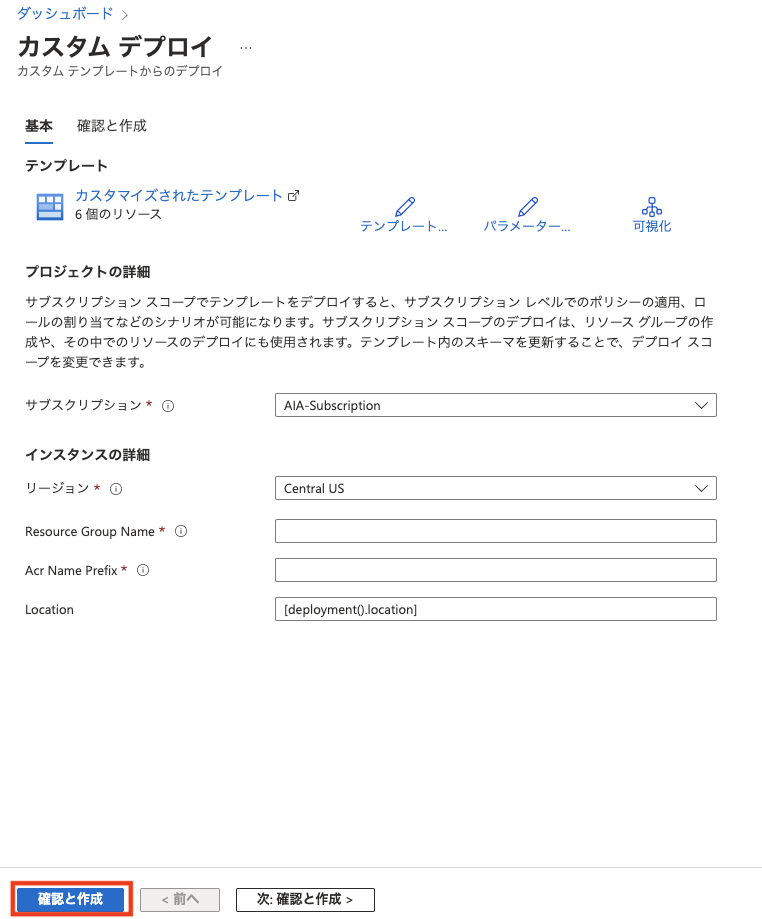
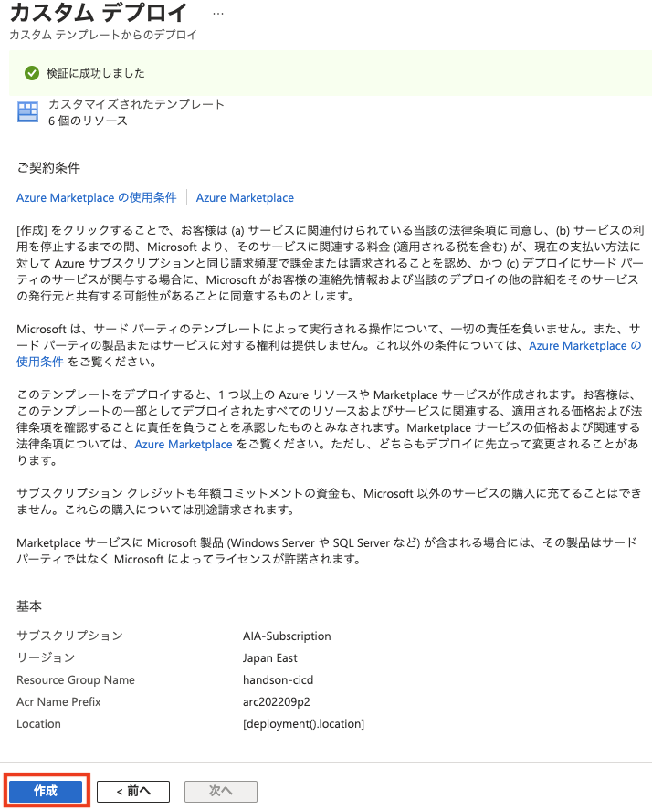
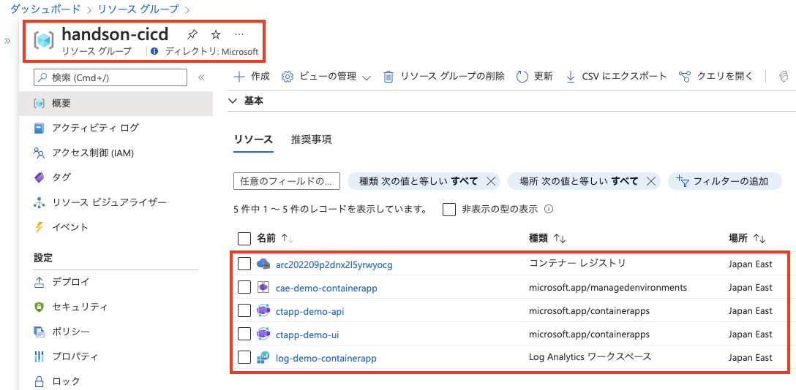

# 準備: Azure リソースを作成
演習２に入る前に必要な準備作業を実施
  

## 1. Azure リソースの作成

1. 以下テンプレート使用して演習２用の Azure リソースを作成
    
    > 注: 演習１で作成した Azure のリソースを流用して演習２で使用することも可能ですが、二つの演習との比較ができるため、分けて作成をお勧め

1. カスタム デプロイ画面の各項目を以下のように設定し、`確定と作成` ボタン-> `作成` ボタンの順番でボタンをクリックし、 Azure リソースを作成
    
    |  項目  |  値  |
    | ---- | ---- |   
    | サブスクリプション * | 演習用のサブスクリプション |
    | リージョン * | Japan East |
    | Resource Group Name * | [演習１のリソースグループ名]-CICD|
    | Arc Name Prefix * | 一意になる文字列|
    | Location | 変更不要 |

    
    

1. 作成が成功すると、リソースグループに以下のリソースが作成される

    

## 2. 演習で使用するプロジェクトの入手
この演習は演習１で作成された成果物をそのまま使用

- **API アプリ** 
- **UI アプリ**

| 前の手順へ | 次の手順へ |
|:---|---:|
|**事前準備** | [**タスク１ - GitHub アクション雛形作成**](P2-01.md) |