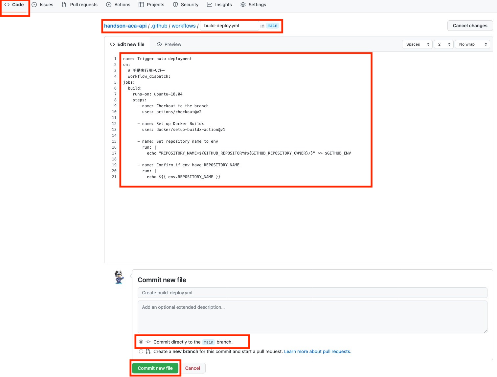
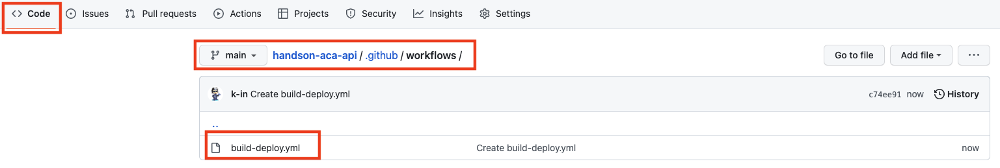
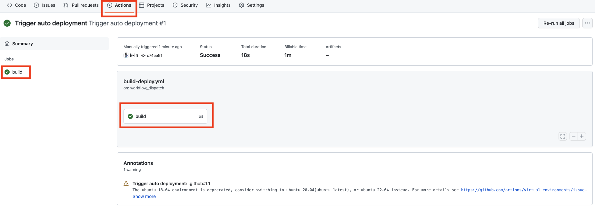

# 演習 2) タスク 1 - GitHub アクション雛形を作成
対象リポジトリにて新規ファイルを作成し、GitHub アクションの雛形を作成して、後続の演習で CI/CD 用の処理を追加していきます。

> **注:** 演習作業簡略化のため、ファイルの作成と編集は main ブランチに対して直接行います。

## 作業
1. GitHub リポジトリにて新規ファイルを作成します。  

    

2. 下記コードをコピーして、 `.github/workflows/build-deploy.yml` として作成します。
    ```yaml
    name: Trigger auto deployment
    on:
      # 手動実行用トリガー
      workflow_dispatch:      
    jobs:
      build:
        runs-on: ubuntu-18.04
        steps:
          - name: Checkout to the branch
            uses: actions/checkout@v2

          - name: Set up Docker Buildx
            uses: docker/setup-buildx-action@v1

          - name: Set repository name to env
            run: | 
              echo "REPOSITORY_NAME=${GITHUB_REPOSITORY#${GITHUB_REPOSITORY_OWNER}/}" >> $GITHUB_ENV

          - name: Confirm if env have REPOSITORY_NAME
            run: |
              echo ${{ env.REPOSITORY_NAME }}
      ```
    > **注:**  
    > - インデントを注意してください。  
    > -  変更内容は直接 `main` ブランチにコミットしてください。
    
    <br>

    


## 確認
3. build-deploy.yml ファイルが正常に作成されていることを確認します。

    
  
4. 手動実行でワークフローを起動します。
  
    
  
5. ワークフロー処理はエラーなく終了し、build ジョブのログにリポジトリ名が出力されていることを確認します。
  
    

    

    

## 参照情報

- <a href="https://docs.microsoft.com/devops/what-is-devops" target="_blank">What is DevOps?</a>

- **GitHub**

    - <a href="https://docs.github.com/en/actions/quickstart" target="_blank">Quickstart for GitHub Actions</a>
    - <a href="https://docs.github.com/en/repositories/working-with-files/managing-files/creating-new-files" target="_blank">Creating new files</a>
    - <a href="https://docs.github.com/en/actions/monitoring-and-troubleshooting-workflows/using-workflow-run-logs#viewing-logs-to-diagnose-failures" target="_blank">Viewing logs to diagnose failures</a>

---
| READMEへ | 次の手順へ |
|:---|---:|
| [**README**](../README.md#%E6%93%8D%E4%BD%9C%E6%89%8B%E9%A0%86)  | [**タスク 2 - ACR 接続情報を追加**](P2-02.md) |
