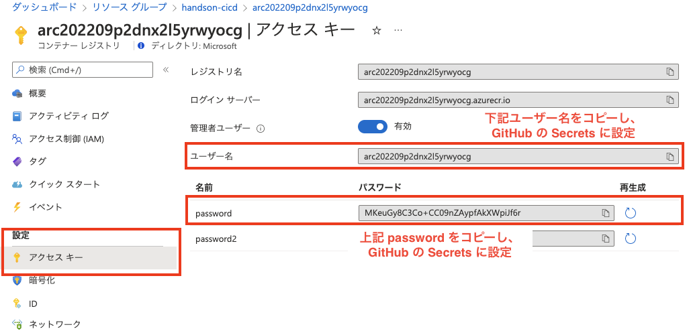
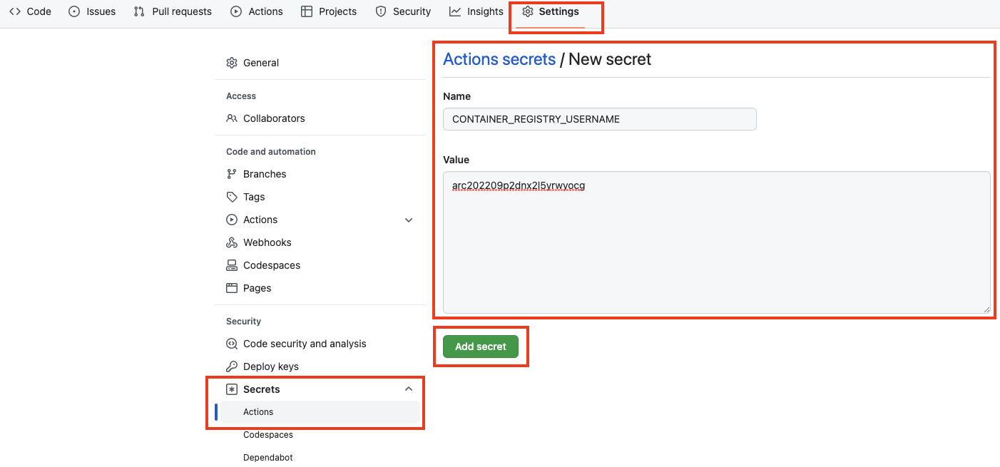
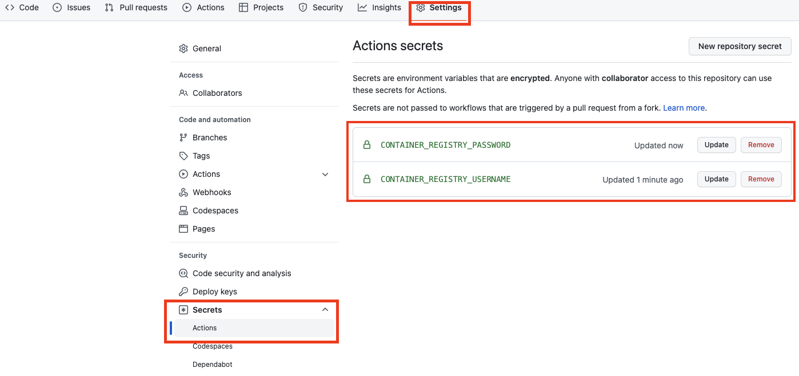

# 演習 2) タスク 2 - ACR 接続情報を追加
ACR に Docker イメージをプッシュする際に認証が必要なため、接続情報と認証処理を GitHub アクションに追加します。

> **注:** 演習作業簡略化のため、ファイルの作成と編集は main ブランチに対して直接行います。

## 作業
- `.github/workflows/build-deploy.yml` ファイルを編集モードで開きます。

  

- ACR のアクセスエンドポイントを定義するための変数を作成します。  
  > **注:** 変数は、ワークフロー ファイルのさまざまなレベルで作成できます。 ただし、ワークフロー ファイル全体で使用できるようにするには、ファイルの一番上、on ステートメントのすぐ下に定義します。変数を定義するには、env パラメーターを使用します。

  `env` とその下に `CONTAINER_REGISTRY` を追加し、ACR のドメイン (~.azurecr.io) を設定します。
  > **注:** ACR のドメインは、準備作業で作成された ACR リソースの `概要` タブ `ログインサーバー` で確認できます。

  

  ```yaml
  # Add env
  env:
    CONTAINER_REGISTRY:  # ACR のドメイン (~.azurecr.io) をこちらに設定
  ```

- 下記 `step` のコードを `.github/workflows/build-deploy.yml` ファイルの末尾に追加します。  

  ```yaml
        # Add a step
        - name: Log in to container registry
          # 認証処理を行うためのアクション
          uses: docker/login-action@v1
          with:
            registry: ${{ env.CONTAINER_REGISTRY }}
            username: ${{ secrets.CONTAINER_REGISTRY_USERNAME }}
            password: ${{ secrets.CONTAINER_REGISTRY_PASSWORD }}
  ```
  > **注:**  
  > - インデントを注意してください。  
  > -  変更内容は直接 `main` ブランチにコミットしてください。
  
  <br>

  

- リポジトリの `Secrets` に `CONTAINER_REGISTRY_USERNAME` と `CONTAINER_REGISTRY_PASSWORD` を追加し、ACR のユーザー名とパスワード (アクセス キー ) を設定します。  

  
  
  
  
  

## 確認

- `.github/workflows/build-deploy.yml` ファイルの変更ができていることを確認します。
  
  

- リポジトリの `Secrets` に `CONTAINER_REGISTRY_USERNAME` と `CONTAINER_REGISTRY_PASSWORD` が作成できていることを確認します。
    
  

- 手動実行でワークフローを起動します。
  
  
  
- ワークフロー処理はエラーなく終了し、build ジョブのログに `Login Succeeded!` のメッセージがが出力されていることを確認します。
  
  

  

  

## 参照情報

- <a href="https://docs.microsoft.com/ja-jp/azure/container-registry/container-registry-intro" target="_blank">Azure における Container Registry の概要</a>

- **GitHub**

    - <a href="https://docs.github.com/en/actions/security-guides/encrypted-secrets#creating-encrypted-secrets-for-a-repository" target="_blank">Creating encrypted secrets for a repository</a>

---
| READMEへ | 次の手順へ |
|:---|---:|
| [**README**](../README.md#%E6%93%8D%E4%BD%9C%E6%89%8B%E9%A0%86)  | [**タスク 3 - ACR にコンテナーイメージ作成処理を追加**](P2-03.md) |
