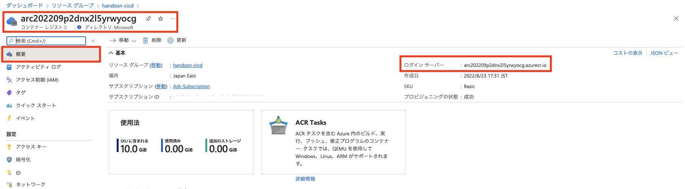
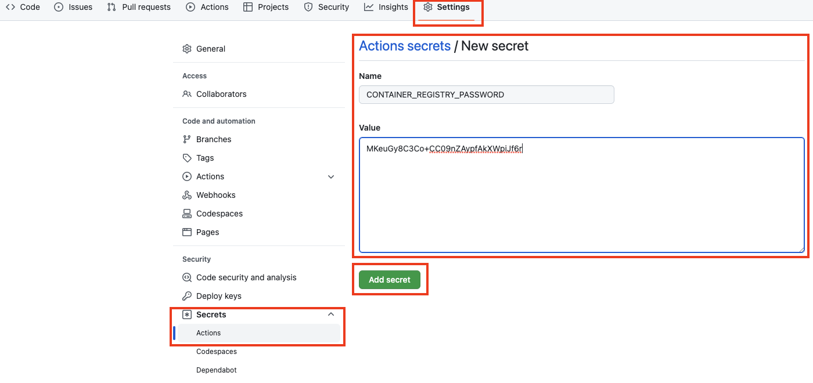
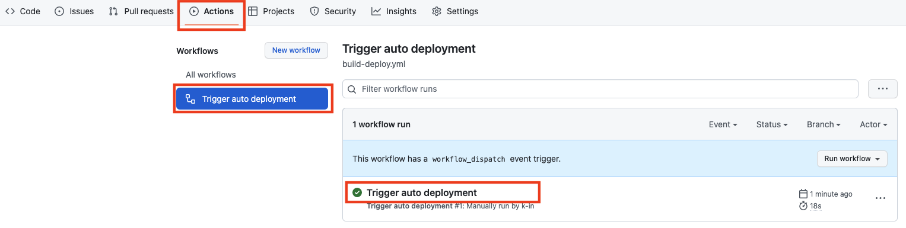

# 演習 2) タスク 2 - Azure Container Registry 接続情報を追加
Azure Container Registry に Docker イメージをプッシュする際に認証が必要なため、接続情報と認証処理を GitHub アクションに追加します。

> **注:** 演習作業簡略化のため、ファイルの作成と編集は main ブランチに対して直接行います。

## 作業
1. 鉛筆マーク<svg aria-hidden="true" height="16" viewBox="0 0 16 16" version="1.1" width="16" data-view-component="true" class="octicon octicon-pencil">
    <path fill-rule="evenodd" d="M11.013 1.427a1.75 1.75 0 012.474 0l1.086 1.086a1.75 1.75 0 010 2.474l-8.61 8.61c-.21.21-.47.364-.756.445l-3.251.93a.75.75 0 01-.927-.928l.929-3.25a1.75 1.75 0 01.445-.758l8.61-8.61zm1.414 1.06a.25.25 0 00-.354 0L10.811 3.75l1.439 1.44 1.263-1.263a.25.25 0 000-.354l-1.086-1.086zM11.189 6.25L9.75 4.81l-6.286 6.287a.25.25 0 00-.064.108l-.558 1.953 1.953-.558a.249.249 0 00.108-.064l6.286-6.286z"></path>
</svg>のボタンをクリックし、`.github/workflows/build-deploy.yml` ファイルを編集モードで開きます。

    

2. Azure Container Registry のアクセスエンドポイントを定義するための変数を作成します。  
  `.github/workflows/build-deploy.yml` ファイル上部の on ステートメントのすぐ下の行に、下記 `env` とその下に `CONTAINER_REGISTRY` を追加し、Azure Container Registry のドメイン (~.azurecr.io) を設定します。
    ```yaml
    # Add env
    env:
      CONTAINER_REGISTRY:  # Azure Container Registry のドメイン (~.azurecr.io) をこちらに設定
    ```
    > **注:** 変数は、ワークフロー ファイルのさまざまなレベルで作成できます。 本ハンズオンではワークフロー ファイル全体で使用できるようトップ レベルに定義します。 

    > **注:** Azure Container Registry のドメインは、準備作業で作成された Azure Container Registry リソースの `概要` タブ `ログインサーバー` で確認できます。

    

3. 下記 `step` のコードを `.github/workflows/build-deploy.yml` ファイルの末尾に追加します。  

    ```yaml
          # Add a step
          - name: Log in to container registry
            # 認証処理を行うためのアクション
            uses: docker/login-action@v2
            with:
              registry: ${{ env.CONTAINER_REGISTRY }}
              username: ${{ secrets.CONTAINER_REGISTRY_USERNAME }}
              password: ${{ secrets.CONTAINER_REGISTRY_PASSWORD }}
    ```
    > **注:**  
    > - インデントを注意してください。  
    > -  変更内容は直接 `main` ブランチにコミットしてください。　
    
    `Start commit`をクリックし、`Commit directly to the main branch`となっていることを確認した上で、`Commit changese`ボタンをクリック
    
    

4. リポジトリの `Secrets` に Azure Container Registry への接続情報を保存します。  
  Azure Container Registry の [アクセス キー] より `ユーザー名` と `password` をコピーします。
    
5. リポジトリの [Settings] -> [Secrets] -> [Actions] と辿り、`New repository secret` ボタンをクリックし `Secret` を追加します。  
    <br><br>

    1.  `CONTAINER_REGISTRY_USERNAME` を追加し、上でコピーした Azure Container Registry の `ユーザー名` を保存します。<br>
    <br>
    2. 同様に `CONTAINER_REGISTRY_PASSWORD` を追加し、上でコピーした Azure Container Registry の `password` を設定します。<br>
    

## 確認

6. `.github/workflows/build-deploy.yml` ファイルの変更ができていることを確認します。
  
    

7. リポジトリの `Secrets` に `CONTAINER_REGISTRY_USERNAME` と `CONTAINER_REGISTRY_PASSWORD` が作成できていることを確認します。
    
    

8. タスク 1 の 4. と同様に、手動実行でワークフローを起動します。
  
    
  
9. ワークフロー処理はエラーなく終了し、build ジョブのログに `Login Succeeded!` のメッセージがが出力されていることを確認します。
  
    

    

    

## 参照情報

- <a href="https://docs.microsoft.com/ja-jp/azure/container-registry/container-registry-intro" target="_blank">Azure における Container Registry の概要</a>

- **GitHub**

    - <a href="https://docs.github.com/en/actions/security-guides/encrypted-secrets#creating-encrypted-secrets-for-a-repository" target="_blank">Creating encrypted secrets for a repository</a>

---
次の手順へ: [**タスク 3 - Azure Container Registry にコンテナーイメージ作成処理を追加**](P2-03.md)

前の手順へ: [**タスク 1 - GitHub アクション雛形を作成**](P2-01.md)

READMEへ: [**README**](../README.md#%E6%93%8D%E4%BD%9C%E6%89%8B%E9%A0%86)
