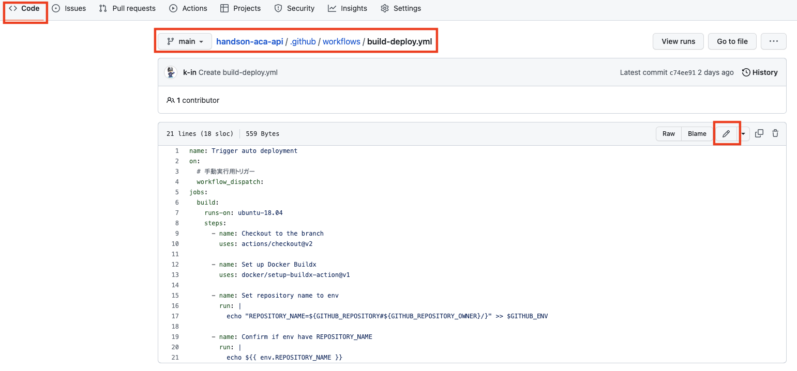
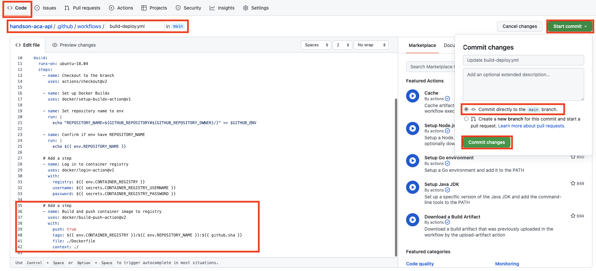
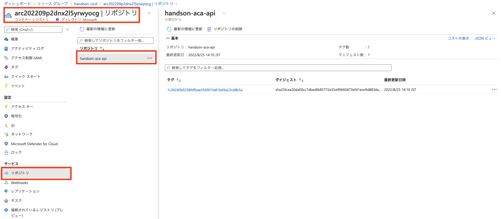

# 演習 2) タスク 3 - ACR にコンテナーイメージ作成処理を追加
ACR に Docker イメージをプッシュする処理を GitHub アクションに追加します。

> **注:** 演習作業簡略化のため、ファイルの作成と編集は main ブランチに対して直接行います。

> **注:** 演習 1 作成した Dockerfile がそれぞれの対象リポジトリにコミットされていることを確認してください。
  
  


## 作業
1. `.github/workflows/build-deploy.yml` ファイルを編集モードで開きます。

    

2. 下記 `step` のコードを `.github/workflows/build-deploy.yml` ファイルの末尾に追加します。  

    ```yaml
          # Add a step
          - name: Build and push container image to registry
            uses: docker/build-push-action@v2
            with:
              push: true
              tags: ${{ env.CONTAINER_REGISTRY }}/${{ env.REPOSITORY_NAME }}:${{ github.sha }}
              file: ./Dockerfile
              context: ./
    ```
    > **注:**  
    > - インデントを注意してください。  
    > -  変更内容は直接 `main` ブランチにコミットしてください。
    
    <br>

    

## 確認

3. `.github/workflows/build-deploy.yml` ファイルの変更ができていることを確認します。
  
    
  
4. 手動実行でワークフローを起動します。
  
    

5. ワークフロー処理はエラーなく終了し、ACR にコンテナー イメージが作成されていることを確認します。
  
    

6. ACR にコンテナー イメージが作成されていることを確認できます。

    

## 参照情報

- <a href="https://docs.microsoft.com/ja-jp/azure/container-registry/container-registry-intro" target="_blank">Azure における Container Registry の概要</a>

- **GitHub**

    - <a href="https://docs.github.com/en/actions/monitoring-and-troubleshooting-workflows/about-monitoring-and-troubleshooting" target="_blank">About monitoring and troubleshooting</a>
---
| READMEへ | 次の手順へ |
|:---|---:|
| [**README**](../README.md#%E6%93%8D%E4%BD%9C%E6%89%8B%E9%A0%86)  | [**タスク 4 - Deploy ジョブを追加**](P2-04.md) |
