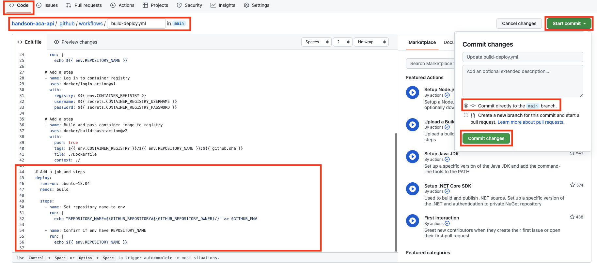
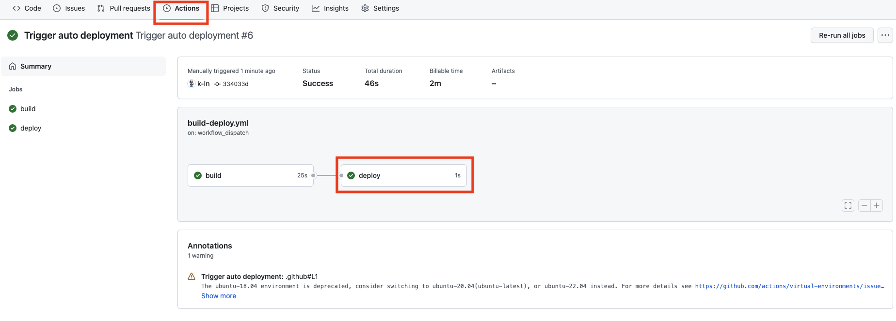

# 演習 2) タスク 4 - Deploy ジョブを追加
GitHub アクションより Azure リソースをデプロイするためのジョブ雛形を GitHub アクションに追加します。

> **注:** 演習作業簡略化のため、ファイルの作成と編集は main ブランチに対して直接行います。

## 作業
- `.github/workflows/build-deploy.yml` ファイルを編集モードで開きます。

  
  
- 下記 `job` のコードを `.github/workflows/build-deploy.yml` ファイルの末尾に追加します。  
  
  ```yaml
    # Add a job and steps
    deploy:
      runs-on: ubuntu-18.04
      needs: build
    
      steps:
        - name: Set repository name to env
          run: | 
            echo "REPOSITORY_NAME=${GITHUB_REPOSITORY#${GITHUB_REPOSITORY_OWNER}/}" >> $GITHUB_ENV

        - name: Confirm if env have REPOSITORY_NAME
          run: |
            echo ${{ env.REPOSITORY_NAME }}
  ```
  > **注:** インデントを注意してください。

  

## 確認

- `.github/workflows/build-deploy.yml` ファイルの変更ができていることを確認します。
  
  
  
- 手動実行でワークフローを起動します。
  
  
  
- ワークフロー処理はエラーなく終了し、deploy ジョブのログにリポジトリ名が出力されていることを確認します。
  
  

  

## 参照情報

- <a href="https://docs.microsoft.com/devops/what-is-devops" target="_blank">What is DevOps?</a>

- **GitHub**

    - <a href="https://docs.github.com/en/actions/monitoring-and-troubleshooting-workflows/about-monitoring-and-troubleshooting" target="_blank">About monitoring and troubleshooting</a>
---
| READMEへ | 次の手順へ |
|:---|---:|
| [**README**](../README.md)  | [**タスク 5 - Azure 接続処理を追加**](P2-05.md) |