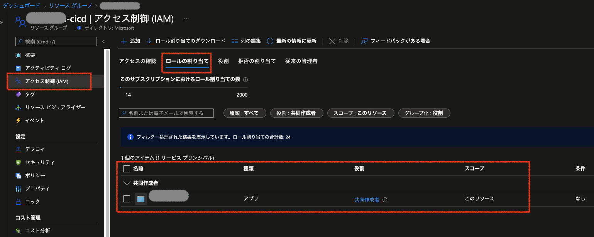

# 演習２)  タスク５ - Azure 接続処理を追加

**注意!**

- 

---

## 作業
- Azure AD アプリの作成、 IAM 設定、Secrets の設定
  - Azure AD アプリの作成

    
  
  - Azure AD アプリの IAM を設定  
  
    

  - Azure AD アプリに GitHub 視覚情報を設定
  
    

  - GitHub に Secrets を設定
  
    

パーミッションの設定が必要
- 下記 `step` を `.github/workflows/build-deploy.yml` ファイルの末尾に追加 (インデント注意)
  ```yaml
      # Add a step
      - name: Azure Login using OIDC
        uses: azure/login@v1
        with:
          client-id: ${{ secrets.AZURE_CLIENT_ID }}
          tenant-id: ${{ secrets.AZURE_TENANT_ID }}
          subscription-id: ${{ secrets.AZURE_SUBSCRIPTION_ID }}
  ```
  > **注:** インデントを注意してください。

## 確認
手動実行で動作確認し、Azure へのログインが成功していれば OK


## 参照情報

- <a href="https://docs.microsoft.com/ja-jp/azure/active-directory/develop/quickstart-register-app" target="_blank">Microsoft ID プラットフォームにアプリケーションを登録する</a>

- **GitHub**

    - <a href="https://docs.github.com/en/actions/deployment/security-hardening-your-deployments/configuring-openid-connect-in-azure" target="_blank">Configuring OpenID Connect in Azure</a>