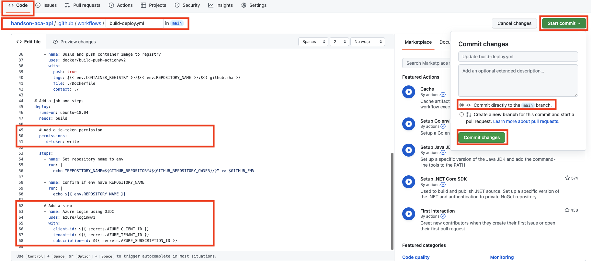

# 演習 2)  タスク 5 - Azure 接続処理を追加
GitHub アクションより Azure リソースをデプロイするため、Azure 側と GitHub 側の認証関連の設定を行います。そして、 GitHub アクションに Azure への Login 処理を追加します。

> **注:** 演習作業簡略化のため、ファイルの作成と編集は main ブランチに対して直接行います。

## 作業
- Azure AD アプリの作成、 IAM 設定、Secrets の設定を行います。
  - Azure AD アプリを作成します。

    
  
  - Azure AD アプリに GitHub 資格情報を設定します。
    > **注:**  
    > - API アプリの場合は、API アプリのレポジトリ名を設定します。
    > - UI アプリの場合は、UI アプリのレポジトリ名を設定します。

    
  
  - 演習 2 の[準備作業](P2-00.md)で作成されていた Azure リソースグループに対して Azure AD アプリの IAM を `共同作成者` 権限で設定します。  
  
    

  - GitHub に次の Secrets を設定します。 `AZURE_CLIENT_ID`、`AZURE_TENANT_ID`、`AZURE_SUBSCRIPTION_ID`
  
    

- `.github/workflows/build-deploy.yml` ファイルを編集モードで開きます。

  

- ジョブの実行パーミションを設定します。  
  下記 `permissions` を `.github/workflows/build-deploy.yml` ファイルの `deploy` ジョブに追加します。  

  ```yaml
      # Add a id-token permission
      permissions:
        id-token: write
  ```

- 下記 `step` を `.github/workflows/build-deploy.yml` ファイルの末尾に追加します。  

  ```yaml
        # Add a step
        - name: Azure Login using OIDC
          uses: azure/login@v1
          with:
            client-id: ${{ secrets.AZURE_CLIENT_ID }}
            tenant-id: ${{ secrets.AZURE_TENANT_ID }}
            subscription-id: ${{ secrets.AZURE_SUBSCRIPTION_ID }}
  ```
  > **注:**  
  > - インデントを注意してください。  
  > -  変更内容は直接 `main` ブランチにコミットしてください。
  
  <br>

  

## 確認

- `.github/workflows/build-deploy.yml` ファイルの変更ができていることを確認します。
  
  
  
- 手動実行でワークフローを起動します。
  
  
  
- ワークフロー処理はエラーなく終了し、deploy ジョブのログに `Login successful.` のメッセージがが出力されていることを確認します。

  
  
## 参照情報

- <a href="https://docs.microsoft.com/ja-jp/azure/active-directory/develop/quickstart-register-app" target="_blank">Microsoft ID プラットフォームにアプリケーションを登録する</a>

- **GitHub**

    - <a href="https://docs.github.com/en/actions/deployment/security-hardening-your-deployments/configuring-openid-connect-in-azure" target="_blank">Configuring OpenID Connect in Azure</a>
    - <a href="https://docs.github.com/ja/actions/deployment/security-hardening-your-deployments/configuring-openid-connect-in-amazon-web-services#adding-permissions-settings" target="_blank">Adding permissions settings</a>
---
| READMEへ | 次の手順へ (API アプリ) | 次の手順へ (UI アプリ) |
|:---|---:|---:|
| [**README**](../README.md#%E6%93%8D%E4%BD%9C%E6%89%8B%E9%A0%86)  | [**タスク 6 - Container App にアプリをデプロイする処理を追加**](P2-06-a.md) | [**タスク 6 - Container App にアプリをデプロイする処理を追加**](P2-06-b.md) |
