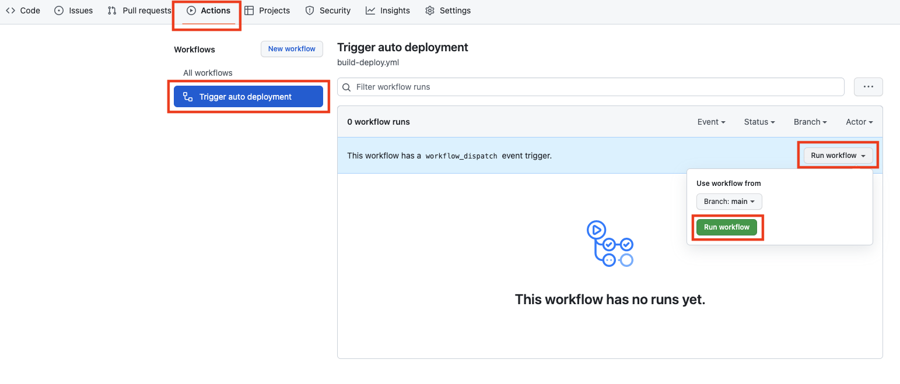
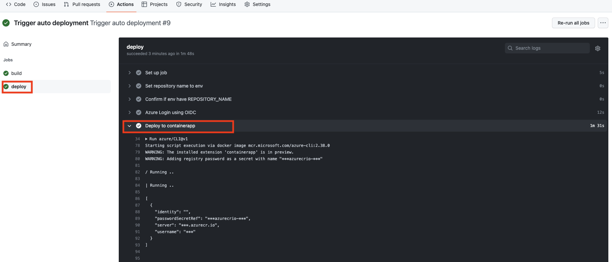
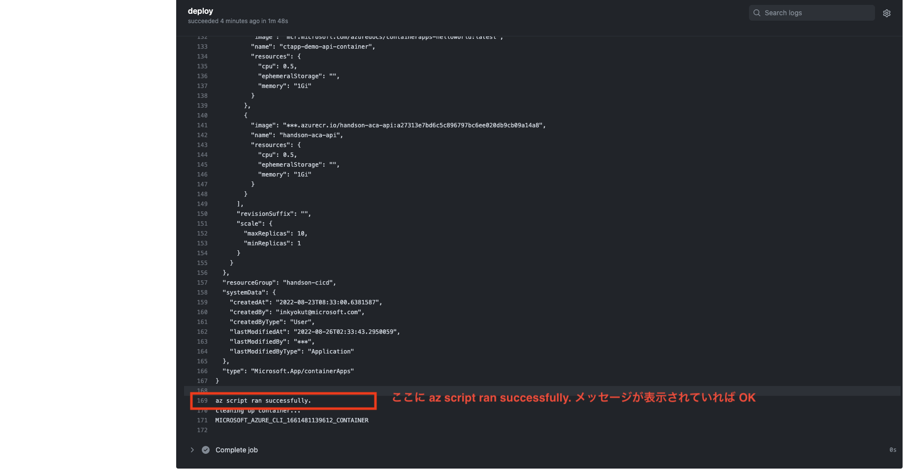

# 演習 2)  タスク 6 - Container App にアプリをデプロイする処理を追加
API アプリを Container App にデプロイするための処理を GitHub アクションに追加します。

> **注:** 演習作業簡略化のため、ファイルの作成と編集は main ブランチに対して直接行います。

## 作業
1. `.github/workflows/build-deploy.yml` ファイルを編集モードで開きます。

    
  
2. `env` に下記環境変数を追加し、対象アプリと Azure の環境に合わせて、以下を設定します。

    - リソース グループ名
    - デプロイ先の Container App 名 - API アプリ

    ```yaml
      # Add envs
      RESOURCE_GROUP_NAME: # 準備タスクで作成されたリソースグループ名をここに記載
      CONTAINERAPP_NAME:  # 準備タスクで作成された API Container App 名をここに記載
    ```
    

3. 下記 `step` コードを `.github/workflows/build-deploy.yml` ファイルの末尾に追加します。

    ```yaml
          # Add a step
          - name: Deploy to containerapp
            uses: azure/CLI@v1
            with:
              inlineScript: |
                az extension add --upgrade --name containerapp

                az containerapp registry set \
                  --name ${{ env.CONTAINERAPP_NAME }} \
                  --resource-group ${{ env.RESOURCE_GROUP_NAME }} \
                  --server ${{ env.CONTAINER_REGISTRY }} \
                  --username  ${{ secrets.CONTAINER_REGISTRY_USERNAME }} \
                  --password ${{ secrets.CONTAINER_REGISTRY_PASSWORD }}

                az containerapp ingress enable \
                  --name ${{ env.CONTAINERAPP_NAME }} \
                  --resource-group ${{ env.RESOURCE_GROUP_NAME }} \
                  --target-port 3500 \
                  --type external

                container_name=$( \
                  az containerapp show \
                    --name ${{ env.CONTAINERAPP_NAME }} \
                    --resource-group ${{ env.RESOURCE_GROUP_NAME }} \
                    --query "properties.template.containers[0].name" \
                    --output tsv
                )
                az containerapp update \
                  --name ${{ env.CONTAINERAPP_NAME }} \
                  --resource-group ${{ env.RESOURCE_GROUP_NAME }} \
                  --container-name $container_name \
                  --image ${{ env.CONTAINER_REGISTRY }}/${{ env.REPOSITORY_NAME }}:${{ github.sha }}
    ```
    > **注:**
    >
    > - インデントを注意してください。
    > - 変更内容は直接 `main` ブランチにコミットしてください。
    > - `az containerapp ingress enable` の `--target-port` オプションは API アプリの場合は `3500` を指定。  

    <br>  

    


## 確認
4. `.github/workflows/build-deploy.yml` ファイルの変更ができていることを確認します。
  
    
  
5. 手動実行でワークフローを起動します。
  
    
  
6. ワークフロー処理はエラーなく終了し、deploy ジョブのログに `az script ran successfuly.` のメッセージがが出力されていることを確認します。

    
    
      
7. API アプリの Container App にリビジョンとしてデプロイされていることが確認できます。
    
    
    
8. API アプリの URL にアクセスして動作確認ができます。 
    
    

9. API アプリの リポジトリの `routes/index.js` に記載されているメッセージが表示されていることが確認できます。 
    
    

10. API アプリの URL + `/albums` にアクセスし、JSON が表示されていることが確認できます。 
    
    

## References

- <a href="https://docs.microsoft.com/ja-jp/azure/container-apps/get-started?tabs=bash" target="_blank">最初のコンテナー アプリをデプロイする</a>

- **GitHub**

    - <a href="https://docs.github.com/en/actions/monitoring-and-troubleshooting-workflows/about-monitoring-and-troubleshooting" target="_blank">About monitoring and troubleshooting</a>
    - <a href="https://docs.github.com/en/actions/examples/using-scripts-to-test-your-code-on-a-runner" target="_blank">Using scripts to test your code on a runner</a>
---
| READMEへ | 次の手順へ |
|:---|---:|
| [**README**](../README.md#%E6%93%8D%E4%BD%9C%E6%89%8B%E9%A0%86)  | [**タタスク 7 - (Option) CI/CD を体験**](P2-07-a.md) |