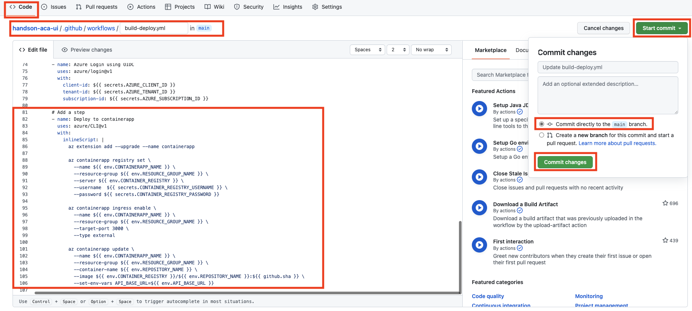

# 演習 2)  タスク 6 - Container App にアプリをデプロイする処理を追加
UI アプリを Container App にデプロイするための処理を GitHub アクションに追加します。

> **注:** 演習作業簡略化のため、ファイルの作成と編集は main ブランチに対して直接行います。

## 作業
- `.github/workflows/build-deploy.yml` ファイルを編集モードで開きます。

  

- `env` に下記環境変数を追加し、対象アプリと Azure の環境に合わせて、以下を設定します。

  - リソース グループ名
  - デプロイ先の Container App 名 - UI アプリ
  - API アプリのベース URL
  

  ```yaml
    # Add envs
    RESOURCE_GROUP_NAME: # 準備タスクで作成されたリソースグループ名をここに記載
    CONTAINERAPP_NAME: # 準備タスクで作成された UI Container App 名をここに記載
    API_BASE_URL: # 準備タスクで作成された API Container App のアプリケーション URL をここに記載
  ```
  

- 下記 `step` コードを `.github/workflows/build-deploy.yml` ファイルの末尾に追加します。

  ```yaml
        # Add a step
        - name: Deploy to containerapp
          uses: azure/CLI@v1
          with:
            inlineScript: |
              az extension add --upgrade --name containerapp

              az containerapp registry set \
                --name ${{ env.CONTAINERAPP_NAME }} \
                --resource-group ${{ env.RESOURCE_GROUP_NAME }} \
                --server ${{ env.CONTAINER_REGISTRY }} \
                --username  ${{ secrets.CONTAINER_REGISTRY_USERNAME }} \
                --password ${{ secrets.CONTAINER_REGISTRY_PASSWORD }}

              az containerapp ingress enable \
                --name ${{ env.CONTAINERAPP_NAME }} \
                --resource-group ${{ env.RESOURCE_GROUP_NAME }} \
                --target-port 3000 \
                --type external

              az containerapp update \
                --name ${{ env.CONTAINERAPP_NAME }} \
                --resource-group ${{ env.RESOURCE_GROUP_NAME }} \
                --container-name ${{ env.REPOSITORY_NAME }} \
                --image ${{ env.CONTAINER_REGISTRY }}/${{ env.REPOSITORY_NAME }}:${{ github.sha }} \
                --set-env-vars API_BASE_URL=${{ env.API_BASE_URL }}
  ```
  > **注:**
  >
  > - インデントを注意してください。
  > - `az containerapp ingress enable` の `--target-port` オプションは UI アプリの場合は `3000` を指定。
  > - 最後の行 `--set-env-vars API_BASE_URL=${{ env.API_BASE_URL }}` は UI アプリ設定時のみ必要。

  <br>  
  

## 確認
- `.github/workflows/build-deploy.yml` ファイルの変更ができていることを確認します。
  
  
  
- 手動実行でワークフローを起動します。
  
  
  
- ワークフロー処理はエラーなく終了し、deploy ジョブのログに `az script ran successfuly.` のメッセージがが出力されていることを確認します。

  
  
  
  UI アプリの Container App にリビジョンとしてデプロイされていることが確認できます。
  
  
  
  UI アプリの URL にアクセスするして動作確認ができます。 
  
  
  

## References

- <a href="https://docs.microsoft.com/devops/what-is-devops" target="_blank">What is DevOps?</a>

- **GitHub**

    - <a href="https://docs.github.com/en/actions/quickstart" target="_blank">Quickstart for GitHub Actions</a>
    - <a href="https://docs.github.com/en/repositories/working-with-files/managing-files/creating-new-files" target="_blank">Creating new files</a>
---
| READMEへ | 次の手順へ |
|:---|---:|
| [**README**](../README.md)  | [**タタスク 7 - (Option) CI/CD を体験**](P2-07-b.md) |