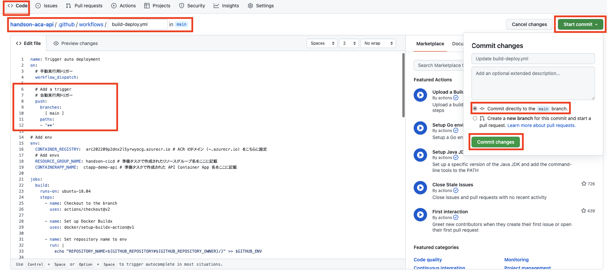
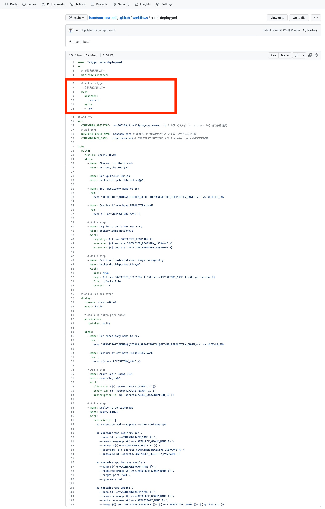
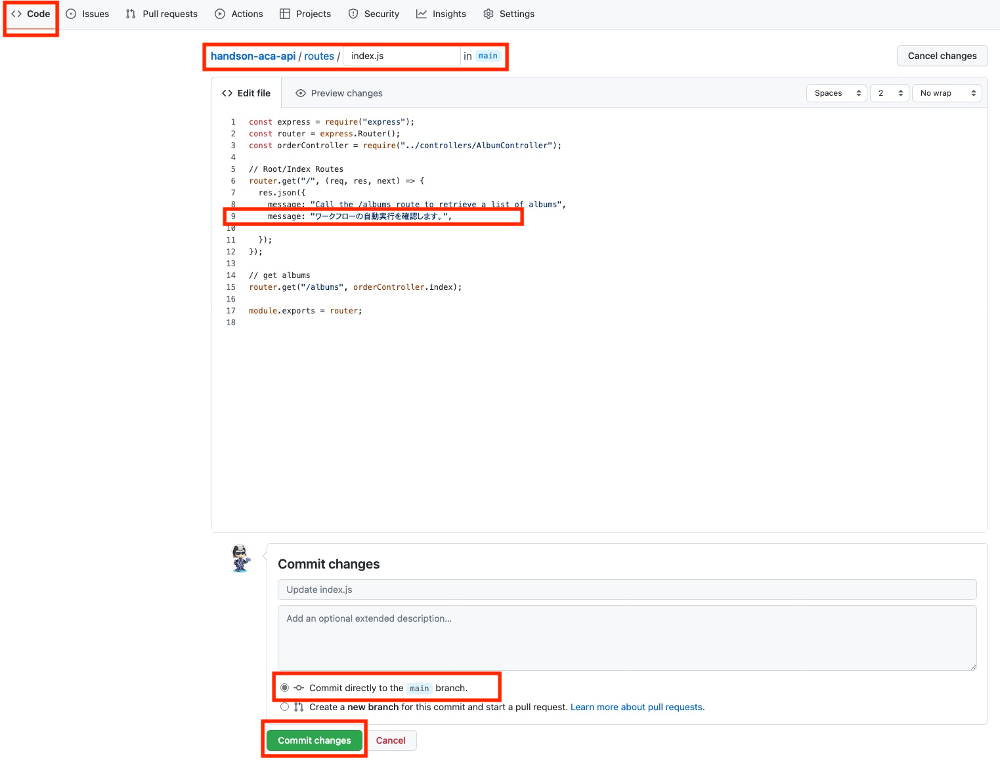
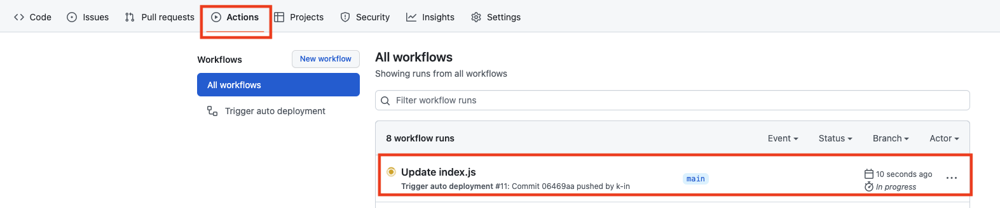
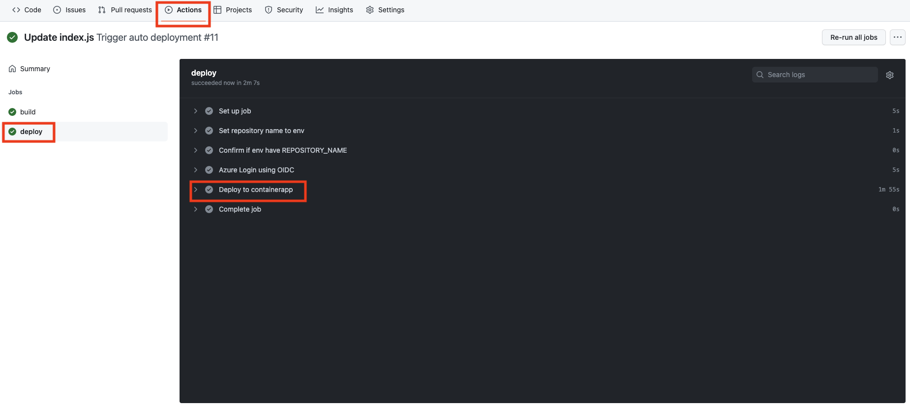
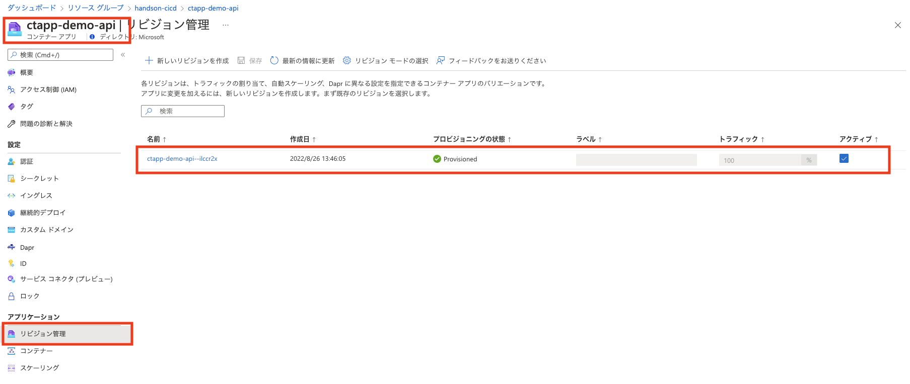
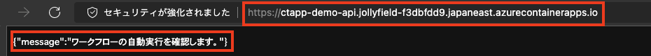

# 演習 2)  タスク 7 - (Option) CI/CD を体験
ソースコードを修正した場合、レポジトリにコミットするとワークフローが自動的に起動だれて、速やかに修正内容を Container App にデプロイするように GitHub アクションを設定します。

> **注:** 演習作業簡略化のため、ファイルの作成と編集は main ブランチに対して直接行います。

## 作業
- `.github/workflows/build-deploy.yml` ファイルを編集モードで開きます。

  

- `.github/workflows/build-deploy.yml` ファイルの `on` の末尾に自動実行用トリガーの `push` を追加します。
  ```yaml
  name: Trigger auto deployment
  on:
    # 手動実行用トリガー
    workflow_dispatch:
    
    # Add a trigger
    # 自動実行用トリガー
    push:
      branches: 
        [ main ]
      paths:
      - '**'
  ```
  > **注:**  
  > - インデントを注意してください。  
  > -  変更内容は直接 `main` ブランチにコミットしてください。
  
  <br>

  


## 確認
- `.github/workflows/build-deploy.yml` ファイルの変更ができていることを確認します。
  
  
  
-  API アプリの レポジトリの `routes/index.js` にメッセージを追加し、`main` ブランチにコミットします。 
  

- ワークフロー処理が自動的に起動されていることを確認します。

  


- ワークフロー処理はエラーなく終了し、API アプリの Container App にリビジョンが更新されていることを確認します。

  
  
  

  API アプリの URL にアクセスするして、追加したメッセージが表示されていることを確認します。 
  
  

## References

- <a href="https://docs.microsoft.com/devops/what-is-devops" target="_blank">What is DevOps?</a>

- **GitHub**

    - <a href="https://docs.github.com/en/actions/quickstart" target="_blank">Quickstart for GitHub Actions</a>

---
| READMEへ |
|:---|
| [**README**](../README.md)  |