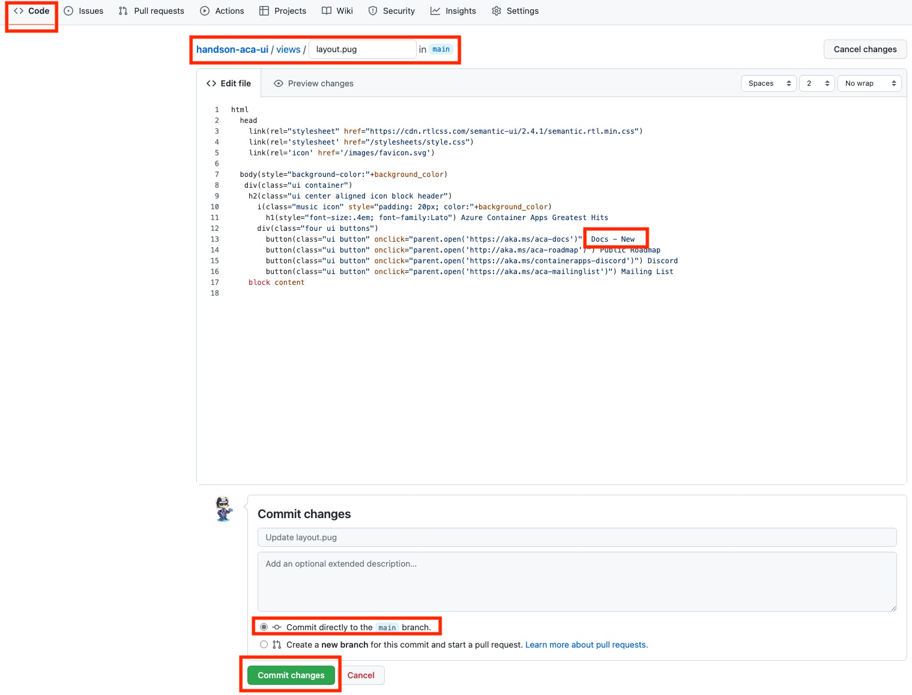
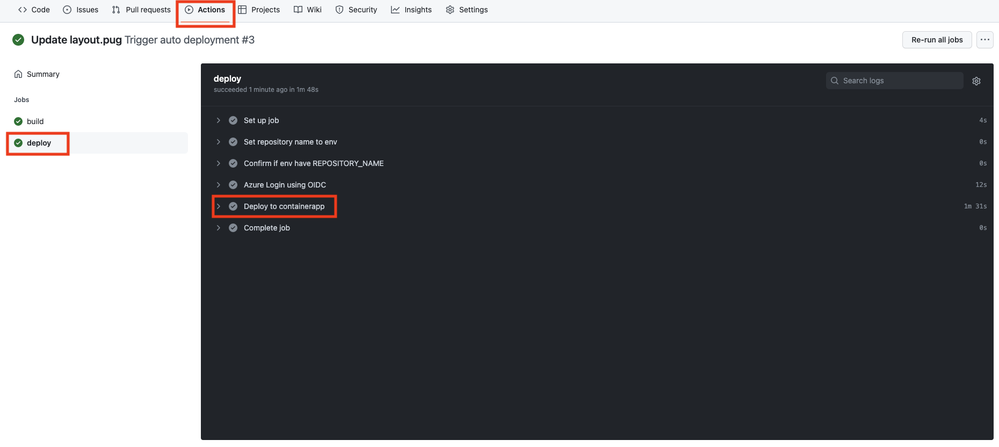

# 演習 2)  タスク 7 - (Option) CI/CD を体験
ソースコードを修正した場合、リポジトリにコミットするとワークフローが自動的に起動だれて、速やかに修正内容を Container App にデプロイするように GitHub アクションを設定します。

> **注:** 演習作業簡略化のため、ファイルの作成と編集は main ブランチに対して直接行います。

## 作業
1. `.github/workflows/build-deploy.yml` ファイルを編集モードで開きます。

    

2. `.github/workflows/build-deploy.yml` ファイルの `on` の末尾に自動実行用トリガーの `push` を追加します。
    ```yaml
    name: Trigger auto deployment
    on:
      # 手動実行用トリガー
      workflow_dispatch:
      
      # Add a trigger
      # 自動実行用トリガー
      push:
        branches: 
          [ main ]
        paths:
        - '**'
    ```
    > **注:**  
    > - インデントを注意してください。  
    > -  変更内容は直接 `main` ブランチにコミットしてください。
    
    <br>

    


## 確認
3. `.github/workflows/build-deploy.yml` ファイルの変更ができていることを確認します。
  
    
  
4.  API アプリの リポジトリの `views/layout.pug` のメニュー文言を変更し、`main` ブランチにコミットします。 
    

5. ワークフロー処理が自動的に起動されていることを確認します。

    


6. ワークフロー処理はエラーなく終了し、API アプリの Container App にリビジョンが更新されていることを確認します。

    
    
    

7. UI アプリの URL にアクセスして、変更後のメニュー文言が表示されていることを確認します。 
  
    

## References

- <a href="https://docs.microsoft.com/ja-jp/azure/container-apps/overview" target="_blank">Azure Container Apps の概要</a>

- **GitHub**

    - <a href="https://docs.github.com/en/actions/using-workflows/about-workflows" target="_blank">About workflows</a>
    - <a href="https://docs.github.com/en/actions/using-workflows/triggering-a-workflow" target="_blank">Triggering a workflow</a>
    
---
前の手順へ: [**タスク 6 - Container App にアプリをデプロイする処理を追加**](P2-06-b.md)

READMEへ: [**README**](../README.md#%E6%93%8D%E4%BD%9C%E6%89%8B%E9%A0%86)
